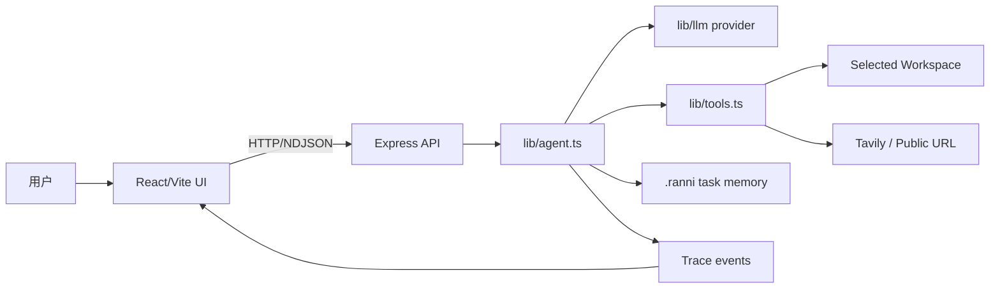
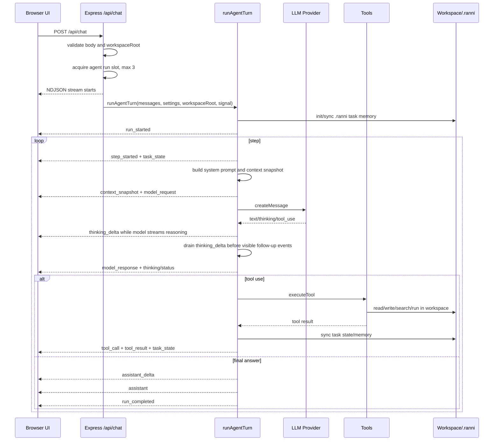

# Runtime Architecture

这份文档说明 Ranni 当前运行时架构：浏览器 UI、Express 服务端、模型 provider、工具执行、workspace 边界和 trace 流如何协作。

## 总体结构



## 前后端运行

开发模式：

- `npm run dev:frontend` 启动 Vite。
- `npm run dev:backend` 启动 Express。
- `npm run dev` 同时启动前后端。
- Vite dev server 代理 `/api` 和 `/health` 到 Express。

生产模式：

- `npm run build` 构建前端和后端。
- 前端产物位于 `dist/client`。
- `npm run start` 启动 Express。
- Express 托管静态网页，同时提供 `/api/*`。

## Chat 请求生命周期



## Agent Run 并发限制

前端按 session 维护正在运行的 agent 请求，最多允许 3 个 run 同时进行。当前 session 正在运行时，输入区显示终止按钮；切换到其他 session 后仍可发起新的 run，直到达到并发上限。

服务端在 `/api/chat` 中维护进程内 active run 计数，请求通过 workspace 校验后先尝试获取 run slot。active run 数量达到 3 时，接口返回 `429` JSON：

```json
{
  "errorCode": "AGENT_CONCURRENCY_LIMIT",
  "error": "同时进行的任务数量已达上限，请等待已有任务完成后再试。",
  "activeCount": 3,
  "limit": 3
}
```

前端识别 `AGENT_CONCURRENCY_LIMIT` 后打开任务上限弹窗。run 完成、失败或取消后，服务端都会释放 slot。

## Workspace 边界

每个 session 有自己的 `workspaceRoot`。用户创建 session 时选择目录，后续 chat 请求都会携带这个路径。

服务端在 `/api/chat` 中校验目录存在且是目录。工具层通过 `resolveWorkspacePath` 把相对路径解析到 workspace 内，并拒绝越界路径。

受 workspace 约束的能力：

- 文件列表、读取、写入、移动、删除。
- 文件内容搜索。
- 终端命令 cwd。
- research notebook。
- `.ranni` task memory。

`AGENT_WORKSPACE_ROOT` 只是未传 session workspace 时的后备值，不是当前产品主路径。

## NDJSON Stream

`/api/chat` 返回 `application/x-ndjson`。每一行是一个 `StreamEvent` JSON。

主要事件：

- `run_started`
- `step_started`
- `context_snapshot`
- `model_request`
- `model_response`
- `thinking_delta`
- `thinking`
- `tool_call`
- `tool_result`
- `research_state`
- `task_state`
- `status`
- `assistant_delta`
- `assistant`
- `step_completed`
- `run_completed`
- `error`
- `done`

前端通过 `applyTraceEventToSession` 把持久事件合并到当前 session 的 runs、steps、feed 和 messages。

`thinking_delta` 是内存态事件，用于会话栏中流式展示模型 thinking 正文。它不会直接写入 session 持久数据，避免 token 级输出频繁写 localStorage。后端会用 paced emitter 发送 thinking delta；模型响应结束后，如果完整 thinking 还有未展示后缀，后端会继续补发 delta，并在 delta drain 完成后再发送后续可见过程事件。完整 `thinking` 事件到达时，前端立即把内容合并到 step trace，并把同一条展示项写回持久 feed。取消或失败时，前端会把已收到的内存态 thinking 内容写回已有展示项再清理内存态。

`assistant_delta` 是最终整体回复的流式事件。前端用它创建或更新同一条 assistant 消息；完整 `assistant` 事件到达后，前端用最终内容校准这条消息，并把它合并到 run trace。

## Abort 传播

用户点击终止后：

1. 前端找到当前 session 的 `AbortController`，abort 对应 fetch。
2. Express 监听 request abort / response close。
3. `runAgentTurn` 收到 signal。
4. 模型请求、retry sleep、工具调用、终端子进程检查 signal。
5. Run 和当前 step 标记为 `cancelled`。

这保证“终止”不是单纯停止 UI 渲染，而是尽量终止后端工作。

## Provider 运行时

`lib/llm/index.ts` 根据 `modelConfig.provider`、`LLM_PROVIDER` 或默认值选择 provider。

前端设置会构造：

```ts
{
  provider,
  apiKey,
  baseUrl,
  model
}
```

服务端也可以从环境变量读取 key 和默认值。

OpenAI provider 走官方 `https://api.openai.com/v1/chat/completions`，默认模型是 `gpt-5.5`，并使用 `max_completion_tokens` 适配 OpenAI Chat Completions 当前参数名。它读取 `OPENAI_BASE_URL` / `OPENAI_MODEL`，避免误用其他 provider 的 `LLM_BASE_URL` / `LLM_MODEL`。

Computer use 是工具层能力，不是主 provider。`operate_computer` 使用 OpenAI Responses API 的 `computer` tool，默认模型 `gpt-5.5`，key 从前端 tool settings、`OPENAI_COMPUTER_API_KEY` 或 `OPENAI_API_KEY` 读取。模型返回 `computer_call` 后，Node 后端通过 macOS 适配器执行截图、点击、滚动、输入、按键和拖拽，再以 `computer_call_output` 回传 `computer_screenshot`。这条链路控制的是用户实际桌面，需要 Screen Recording 和 Accessibility 权限，也会在敏感或破坏性操作前停止。

DeepSeek thinking mode 的特殊点：

- 请求会包含 `thinking: { type: "enabled" }` 和 `reasoning_effort`。
- 后续历史中的 assistant thinking 会作为 `reasoning_content` 回传。
- 这是 DeepSeek API 协议要求，不只是 UI 展示字段。

## Trace Export

Trace 导出是 session 级能力。点击顶部 `导出 trace` 时，前端直接导出当前 session 快照，不依赖某条 assistant 消息或最终回答是否已经产生。

导出文件包含：

- Export 时间。
- Session ID、title、workspace。
- Session messages。
- Process feed。
- Research context。
- 完整 trace runs JSON，包括 running / failed / cancelled / completed run。

文件名使用时间戳，例如：

```text
2026-05-04T08-15-58-018Z-trace.txt
```

## 运行期文件

Ranni 会在 workspace 下写入运行期文件：

- `.ranni/`：task state、todo、verification、evidence、sources、checkpoints。
- `.ranni/runs/<runId>/source-ledger.md`、`claim-ledger.md`、`coverage-matrix.md`、`synthesis-brief.md`：deep research 中间记忆。
- `research/`：research notebook 和 research eval 输出。

它们都被 `.gitignore` 忽略。
