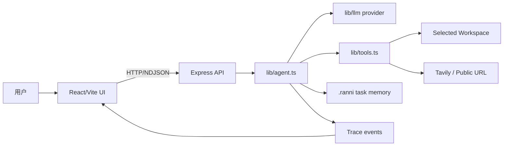
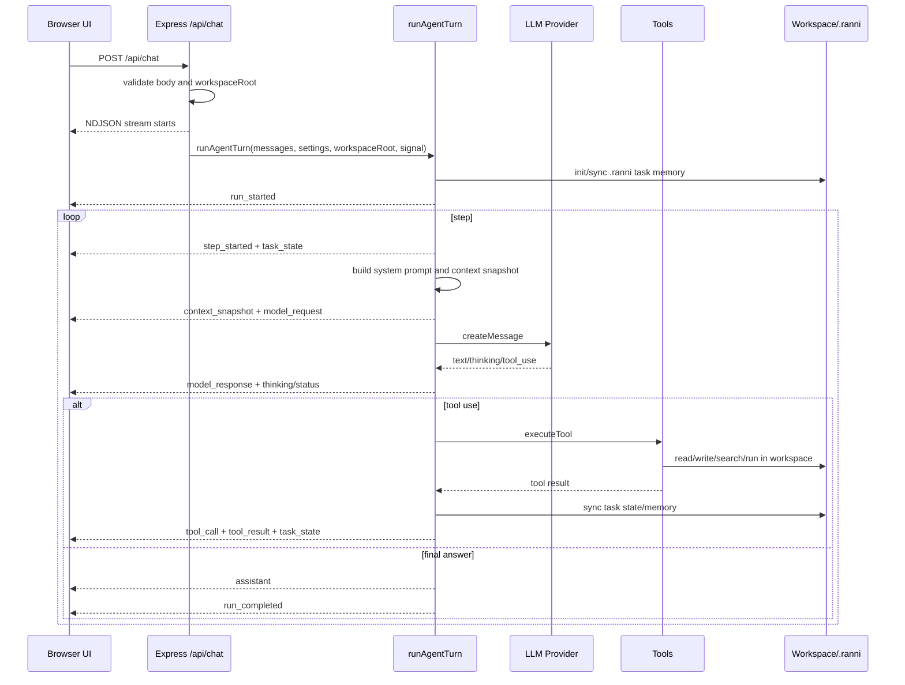

# Runtime Architecture

这份文档说明 Ranni 当前运行时架构：浏览器 UI、Express 服务端、模型 provider、工具执行、workspace 边界和 trace 流如何协作。

## 总体结构



## 前后端运行

开发模式：

- `npm run dev:frontend` 启动 Vite。
- `npm run dev:backend` 启动 Express。
- `npm run dev` 同时启动前后端。
- Vite dev server 代理 `/api` 和 `/health` 到 Express。

生产模式：

- `npm run build` 构建前端和后端。
- 前端产物位于 `dist/client`。
- `npm run start` 启动 Express。
- Express 托管静态网页，同时提供 `/api/*`。

## Chat 请求生命周期



## Workspace 边界

每个 session 有自己的 `workspaceRoot`。用户创建 session 时选择目录，后续 chat 请求都会携带这个路径。

服务端在 `/api/chat` 中校验目录存在且是目录。工具层通过 `resolveWorkspacePath` 把相对路径解析到 workspace 内，并拒绝越界路径。

受 workspace 约束的能力：

- 文件列表、读取、写入、移动、删除。
- 文件内容搜索。
- 终端命令 cwd。
- research notebook。
- `.ranni` task memory。

`AGENT_WORKSPACE_ROOT` 只是未传 session workspace 时的后备值，不是当前产品主路径。

## NDJSON Stream

`/api/chat` 返回 `application/x-ndjson`。每一行是一个 `StreamEvent` JSON。

主要事件：

- `run_started`
- `step_started`
- `context_snapshot`
- `model_request`
- `model_response`
- `thinking`
- `tool_call`
- `tool_result`
- `research_state`
- `task_state`
- `status`
- `assistant`
- `step_completed`
- `run_completed`
- `error`
- `done`

前端通过 `applyTraceEventToSession` 把事件合并到当前 session 的 runs、steps、feed 和 messages。

## Abort 传播

用户点击终止后：

1. 前端 `AbortController` abort 当前 fetch。
2. Express 监听 request abort / response close。
3. `runAgentTurn` 收到 signal。
4. 模型请求、retry sleep、工具调用、终端子进程检查 signal。
5. Run 和当前 step 标记为 `cancelled`。

这保证“终止”不是单纯停止 UI 渲染，而是尽量终止后端工作。

## Provider 运行时

`lib/llm/index.ts` 根据 `modelConfig.provider`、`LLM_PROVIDER` 或默认值选择 provider。

前端设置会构造：

```ts
{
  provider,
  apiKey,
  baseUrl,
  model
}
```

服务端也可以从环境变量读取 key 和默认值。

DeepSeek thinking mode 的特殊点：

- 请求会包含 `thinking: { type: "enabled" }` 和 `reasoning_effort`。
- 后续历史中的 assistant thinking 会作为 `reasoning_content` 回传。
- 这是 DeepSeek API 协议要求，不只是 UI 展示字段。

## Trace Export

Assistant 消息带有 `traceRunId`。点击 `导出 trace` 时，前端查找对应 run，生成文本文件并触发浏览器下载。

导出文件包含：

- Export 时间。
- Session ID、title、workspace。
- Assistant message。
- 完整 trace run JSON。

文件名使用时间戳，例如：

```text
2026-05-04T08-15-58-018Z-trace.txt
```

## 运行期文件

Ranni 会在 workspace 下写入运行期文件：

- `.ranni/`：task state、todo、verification、evidence、sources、checkpoints。
- `research/`：research notebook 输出。

它们都被 `.gitignore` 忽略。

