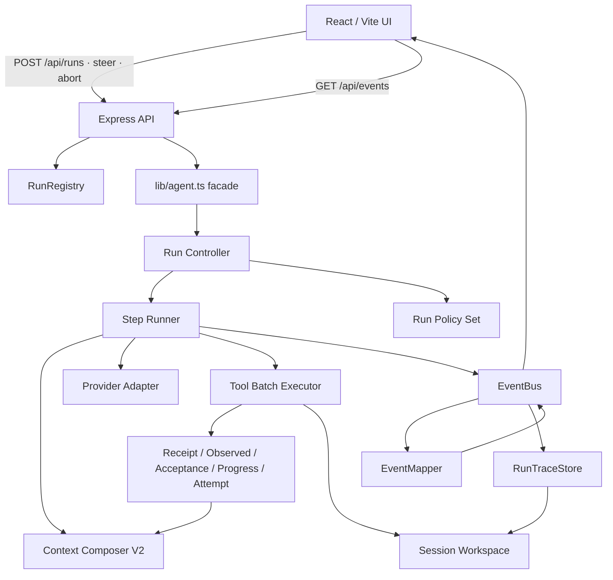

# Ranni 架构报告（与代码对齐版）

本报告描述 2026-07-15 工作树中的通用 Agent Harness、事件链路和持久化边界。共享契约以 [通用 Agent Harness 总览](../v2-architecture/agent-arch/general-agent-harness/01-overview-and-contracts.md) 为准，名词定义见 [glossary.md](./glossary.md)。

## 1. 架构总览

Ranni 是本地优先的 Agent 网页工作台。浏览器通过 HTTP Command 启动、Steering 或中断 Run，通过 Session 级 SSE 接收实时事件。每个 Session workspace 同时承担工具执行边界、任务记忆、工件和 Run Trace 存储边界。



核心依赖方向：公共 facade → 通用 Controller / Runner → Context、Provider、Executor 和纯决策器。HTML-to-PPTX 领域规则由 `lib/policies/registry.ts` 组装，Controller 不按 Skill 名称写业务分支。

## 2. Agent Harness

### 2.1 公共入口与职责边界

`lib/agent.ts` 是 31 行公共 facade，继续导出 `runAgentTurn`、公开入参 / 结果类型和少量兼容纯函数。Server 与 research eval 的调用路径保持不变。

`lib/agent/` 的主要所有权：

| 模块 | 职责 |
| --- | --- |
| `run-controller.ts` | 初始化 Run、抽取 Steering、循环执行 Step、发布最终状态和 checkpoint |
| `step-runner.ts` | 冻结输入、调用模型、处理完整工具批次、更新账本、委托完成判断 |
| `run-state.ts` | Task Contract、conversation、Receipt / Acceptance / Progress / Attempt 实例和 Working Set |
| `tool-batch-executor.ts` | 工具合法性、输入完整性、安全执行、幂等复用和配对结果 |
| `finalization-controller.ts` | Acceptance、evidenceRefs、PPTX 状态、页数、错误与最终文字检查 |
| `recovery-controller.ts` | Abort、瞬时 Provider 故障、确定性恢复和可恢复 checkpoint |
| `chunked-final-controller.ts` | 长回答分段解析、顺序约束、协议修复与最多 8 段聚合 |
| `event-sink.ts` | 三层事件发布与旧 StreamEvent 兼容 |
| `runtime-services.ts` | 集中创建 Task Memory 和 Research Notebook |
| `policy.ts` | 通用 `RunPolicySet` 接口 |

### 2.2 Run 生命周期

`POST /api/runs` 校验 Session workspace，在 RunRegistry 中生成 runId，并先初始化 RunTraceStore。HTTP 成功响应返回后，`runAgentTurn` 在后台执行；返回的 `RunAgentTurnResult.status` 会写回 RunRegistry。

每个 Step 按以下顺序运行：

1. 检查 abort，并在请求边界抽取 Steering。
2. 读取当前 Skill、Policy、Observed State、Acceptance 和 Attempt，构建 Working Set。
3. 生成 system prompt、Context Envelope、Composition Manifest 和 Trace snapshot。
4. 发布 `step.started`、`task.state`、`context.snapshot`、`model.request`。
5. 调用 Provider；完整响应成功后才把 assistant message 追加到 conversation。
6. 工具调用存在时，顺序执行该批次，产生与调用一一配对的 tool result 和 Tool Receipt。
7. 一次性追加整批 tool result，再更新 Observed State、Acceptance、Progress、Attempt 和 Policy。
8. 模型给出文字结果时，由 Finalization Controller 判断继续工具工作、修复最终说明或完成。
9. Provider 或协议错误由 Recovery Controller 处理；外层 Controller 负责结束 Run。

紧急步数上限为 500。No-progress Watchdog 会更早在连续 3 / 6 / 10 轮时反馈、重规划或保存 checkpoint；同策略连续两轮失败也会触发路线检查。

## 3. Context Composer V2

`lib/context/composer.ts` 生成统一 Context Envelope：

- Task Contract：用户目标、交付物、成功条件和授权边界。
- Working Set：Agent Note、Observed State 摘要、active attempt、Acceptance Gap、工件、Research Handoff 和未解决错误。
- Archive Summary：只在容量压力下生成的较老历史摘要。
- Recent Causal Tail：最近四个完整工具因果轮次。
- Steering Messages：当前边界收到的用户补充消息。
- Tool Definitions：本轮真实传给 Provider 的工具定义。
- Composition Manifest：消息数、Token 估计、压缩原因、工具配对、Skill hash、稳定前缀 hash 和 snapshot hash。

Composer 在请求前验证最近 tool call/result 完整配对。上一轮每个 toolUseId 都必须拥有 result，保留数量必须等于预期数量；违反协议时停止新请求。

安全输入预算计算为 context window 减 max output tokens 和 safety margin。估计输入达到该预算 75% 后才压缩较老历史。HTML-to-PPTX 工件关注点、Skill 变化和状态语义失效不会触发容量压缩。最近四个因果轮次保留 Provider continuation 所需 metadata；更早工具调用中的陈旧 Responses reasoning metadata 会被移除。

## 4. 状态、回执与质量闭环

### 4.1 状态分责

- Task Contract 由用户消息和 Harness 维护。
- Agent Note 由 `update_task_state` 表达 mode、next action、assumptions、open questions 和 plan。
- Observed State 由 Receipt Registry 维护文件、命令、证据、工件、验证和错误。
- Plan / Attempt Ledger 维护当前路线、退出条件、失败和替代关系。
- Acceptance Ledger 从 Deliverable Contract 派生 required criterion。

`update_task_state` 不接受 goal、deliverable、constraints、success criteria、facts、files、commands 或 verification 的模型写入。同义 patch 返回 `noChange: true`，不会重写 Task Memory，也不会产生 objective progress。

### 4.2 Tool Receipt

每条 Tool Receipt 包含 toolUseId、输入 / 结果 hash、domain status、耗时、策略签名和事实投影。`run_terminal` 的非零退出码或 timeout 记为 domain failure。Receipt Registry 按 `(toolUseId, inputHash)` 返回已经完成的执行，避免重试导致工具副作用重复发生。

HTML-to-PPTX Receipt projector 把 manifest、style、slide、deck、prepared HTML、PPTX export 和 validate 结果转换成工件生命周期。Validation 成功可以关闭同一交付范围内先前的工件或验证错误。

### 4.3 Progress 与 Attempt

Progress Receipt 分别记录：

- objective progress：required criterion 变为 passed，交付缺口缩小。
- information gain：新增证据或首次出现的诊断。
- regression：已通过 criterion 回退。

重复状态更新、未变化读取、相同搜索和重复错误不会增加 objective progress。Information gain 不会重置无交付推进连续轮数。Progress 的策略签名与 Attempt Ledger 共同识别重复失败路线。

### 4.4 Completion 与 Recovery

Finalization Controller 要求所有 required criterion 为 passed 或拥有用户明确 waived 依据，并检查 evidenceRefs 仍存在于当前 Observed State。PPTX 任务额外要求最新 PPTX 状态为 validated、验证通过，并且页数与用户要求精确一致。覆盖交付物的 unresolved error 也会阻止完成。

长回答可以使用 `RANNI_FINAL_PART n/N` 分段协议。分段期间工具定义为空，协议遗漏或编号错误会请求当前段修复；输出上限导致的长 final 会从 PART 1 重新生成。Harness 最多聚合 8 段，只有聚合后的完整候选才进入完成验收。

本机 ChatGPT 订阅 Provider 把一次 SSE 尝试作为原子响应。只有收到 `done` 后才提交 thinking、文本和 function call；提前 EOF、SSE error、网络故障、408 / 429 / 5xx 最多额外重试两次，退避为 100ms / 250ms。重试复用同一个请求体，失败尝试的半截内容会被丢弃，abort 会立即停止。

重试耗尽后，Recovery Controller 保存 Acceptance、Observed State、active attempt 和 Context snapshot hash。交付仍有缺口时返回可恢复 checkpoint，禁止 final synthesis。全部 required criterion 已有确定性证据时，可以基于工件路径和验收结果生成确定性恢复说明。

## 5. Skill 与 Policy

`lib/skills/registry.ts` 扫描 `skills/*/SKILL.md`，索引包含 name、description、version、正文 SHA-256 hash 和资源路径。用户显式启用与 Agent `load_skill` 统一进入 loaded skill 集合；激活正文、专属工具和 runtime instructions 会进入后续 Context。

`lib/policies/registry.ts` 当前负责选择文本 Deliverable Contract 或 HTML-to-PPTX Policy。HTML-to-PPTX 工件关注点为 off / styles / slides：

- `init_slide_html_workspace` 成功后进入 styles。
- `assemble_deck_styles` 成功后进入 slides。
- 非 off 状态移除 `write_file`、`move_path`、`delete_path`、`run_terminal`，防止绕过专用工件工具。
- 文件观察、网页研究、Research ledger、Task Memory、工件检查和验证工具持续开放。

页数要求从用户 prompt 派生。八页 PPTX 的 Deliverable Contract 包含 manifest、styles、8 个 accepted slide、assembled deck、exported PPTX、final QA 和精确 8 页验证 criterion。

## 6. 事件、Trace 与 HTTP API

### 6.1 三层事件

- Layer 1 ProviderEvent：`text.delta`、`thinking.delta`，live-only。
- Layer 2 TraceEvent：Run、Step、tool、text、thinking、model、context、task、research 基础事实，以及 `tool.batch.started`、`tool.receipt`、`state.observed.updated`、`attempt.updated`、`assumption.invalidated`、`acceptance.updated`、`progress.receipt`、`recovery.started`、`completion.checked`。
- Layer 3 ClientNotification：面向 UI 的 activity、assistant、thinking、research、lifecycle 和 error 投影。

EventBus 为 durable 事件分配 Session 级单调 seq，并用 2000 条 ring buffer 提供运行期断线续传。EventMapper 默认采用确定性 display；`RANNI_ACTIVITY_REWRITE_ENABLED=true` 才会启用辅助模型改写。

### 6.2 RunTraceStore

`lib/runs/run-trace-store.ts` 订阅 durable 运行事实，落盘前递归脱敏 API key、authorization、cookie、password、secret 和 token 类字段。存储布局：

```text
.ranni/runs/<runId>/
├── run.json
├── step-index.json
├── trace.jsonl
└── steps/
    ├── 0001-input.json
    ├── 0001-output.json
    └── ...
```

Input 在 `context.snapshot` 和首次 `model.request` 到达后冻结，包含 Context 与 exact request。Output 增量聚合 thinking、assistant text、tool call/result/receipt、TaskState、Observed State、Attempt、Assumption、Acceptance、Progress、Completion 和 Recovery。

### 6.3 查询 API

- `GET /api/sessions/:sessionId/runs?workspaceRoot=<workspace>`
- `GET /api/runs/:runId/steps?workspaceRoot=<workspace>`
- `GET /api/runs/:runId/steps/:stepId/io?workspaceRoot=<workspace>`

运行中的 API 使用 RunRegistry 在启动 Run 时登记的 workspaceRoot。历史 Session 查询由 UI 附带已选择的 workspaceRoot，RunTraceStore 扫描 `.ranni/runs/`、校验 runId / sessionId 并恢复只读映射，因此服务重启后仍能读取 Step。独立 raw、diff、区间导出和 cursor / filter API 仍未实现。

`components/run-observability.tsx` 在运行详情中提供运行概览和 Step 输入输出查看器。概览展示当前路线、下一步、验收清单、交付缺口、阻塞、完成依据和进展回执；查看器展示 Input / Output / 原始数据、Context Composition、因果健康与 tool call/result 配对。`components/run-observability-model.ts` 负责确定性语义投影，并在持久化 I/O 不可用时回退到实时 Legacy Trace。

## 7. Workspace、工具与 Provider

`POST /api/runs` 要求 workspace 位于默认 Session 根目录并满足 `ranni-session-*` 命名。文件、搜索、终端、Research Notebook、Task Memory、Trace 和工件都使用该 workspace。`resolveWorkspacePath` 拒绝越界路径；终端继续受危险命令黑名单和 timeout 约束。

工具注册入口仍是 `lib/tools.ts`，Skill 工具通过 active skill 合并。Tool Batch Executor 首轮保持顺序执行语义，完整保留模型单轮请求的全部调用与结果。

Provider 选择位于 `lib/llm/`。DeepSeek、OpenAI、Qwen、MiniMax、自定义兼容层继续使用各自 continuation / thinking 协议；ChatGPT Subscription 额外提供原子 SSE 重试。Provider Adapter 生成的真实 request / response 会进入 Trace。

## 8. 当前完成边界与剩余项

### 已落地

- `lib/agent.ts` facade 与 Run Controller / Step Runner / Executor / Finalization / Recovery 拆分。
- Context Composer V2、完整上一轮工具配对、容量驱动压缩和 Skill Manifest。
- Receipt Registry、Observed State、Acceptance、Progress、Attempt 和 No-progress Watchdog。
- HTML-to-PPTX Deliverable Contract、工件回执、精确页数与验证完成防线。
- ChatGPT Subscription 原子流式重试，失败尝试不污染 conversation。
- Chunked Final 独立控制器与完整聚合后验收。
- 语义 TraceEvent、workspace Run Trace、Step I/O 文件和三个查询 API。
- 运行概览、Step 输入输出查看器、上下文健康和重启后历史 Run 读取。
- Server 和 research eval 继续从 `lib/agent.ts` 调用 `runAgentTurn`。

### 尚需收口

- Run Controller 已满足约 125 行的编排目标；Step Runner 仍需继续拆分输入、工具后处理和 final 路径。
- raw / diff / 导出 API 与 checkpoint 自动 resume 尚未实现。
- 完整 SideEffectGate 和高风险动作审批 UI 仍沿用现有 workspace、命令黑名单和工具级防线。

## 9. 关键不变量

1. 用户目标、交付条件和 workspace 授权边界贯穿整个 Run。
2. 上一轮 reasoning、tool call 与全部 tool result 在下一轮保持因果连续。
3. Context 压缩只由容量需要触发，最近因果尾部保持完整。
4. 模型状态说明不能覆盖 Tool Receipt、Observed State 或 Acceptance。
5. 已成功执行的 toolUseId / input 组合不会因 Provider 重试再次执行。
6. HTML-to-PPTX 未导出、未验证或页数不符时不能完成。
7. Provider 中断保留 workspace、Context hash、Observed State、Attempt 和 Acceptance。
8. Event Log、Step input 和 Step output 记录 Agent 实际看到与产生的事实。
9. Policy 保护权限、协议和工件不变量，同时保留模型对研究、制作、验证和替代路线的自主选择。
