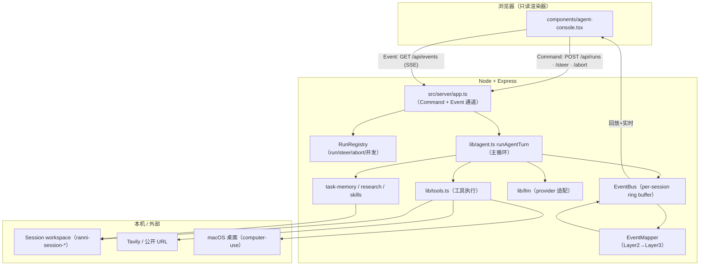

# Ranni 架构报告（与代码对齐版）

本报告描述 Ranni 当前真实运行的架构。它以代码为准绳：凡是写进来的结构、流程、限制，都对应到具体文件和函数，并标注了落点。文档里描述过但代码尚未实现的能力，统一收在第 8 章「已实现 vs 规划中」，避免把设计意图误读为现状。

概念名词的完整定义见同目录 [glossary.md](./glossary.md)；本文只在使用处做最小解释。

## 0. 如何使用本报告

- 想对齐名词 → [glossary.md](./glossary.md)。
- 想看整体长什么样 → 第 1 章。
- 想看 Agent 一轮运行怎么走 → 第 2 章。
- 想知道 Agent 有哪些能力 → 第 3 章。
- 想知道哪些动作会被拦、被限 → 第 4 章。
- 想看前后端怎么通信 → 第 5 章。
- 想区分「文档写了但没做」→ 第 8 章。

## 1. 架构总览

### 1.1 产品形态

Ranni 是本地优先的 AI Agent 网页工作台。前端 `React + Vite`，后端 `Node.js + Express`，浏览器访问本地服务，不依赖 Electron。开发期前后端分别运行（Vite 5173 + Express 3001，Vite 代理 `/api`）；生产构建后 Express 托管 `dist/client` 并继续提供 `/api/*`。

### 1.2 分层

### 1.3 通信模型：Command / Event 正交

前后端解耦的核心是两条通道：

- **Command（HTTP REST）**：`POST /api/runs` 启动 Run（立即返回 `runId`，后台异步执行）、`POST /api/runs/:id/steer` 补充消息、`POST /api/runs/:id/abort` 中断。即发即忘。
- **Event（SSE 单向下行）**：`GET /api/events?streamKey=<sessionId>&lastSeq=N`。前端在发送前就建立 session 级 EventSource，EventBus 的 durable 事件回放保证即使启动与订阅顺序颠倒也不丢事件。

Agent 运行与 HTTP 请求生命周期彻底分离：一次 Run 的所有状态变化都通过 SSE 下发，前端是只读渲染器。

## 2. Agent 主循环（runAgentTurn）

实现：`lib/agent.ts` 的 `runAgentTurn`（约 1675–3011 行）。这是整个 Harness 的心脏。

### 2.1 初始化阶段

接收 `runId / sessionId / streamKey / eventBus / drainSteer / messages / modelConfig / signal / toolSettings / workspaceRoot`（`RunAgentTurnOptions`）。建立：

- `runtime`（模型运行时信息）、`loadedSkills`（已激活 skill 集合）。
- `conversation`（从 messages 转成 `AgentMessage[]`）、`initialConversationMessageCount`。
- `taskState = createInitialTaskState(latestUserPrompt)`（初始 mode=`intake`、verification=`pending`）。
- `taskMemory`、`researchNotebook`、`researchSignals`。
- 各 guard 计数器（初始为 0）：`completionGuardCount`、`artifactOutputRecoveryCount`、`emptyFinalRepairCount`、`modelFailureRecoveryCount`、`researchAnswerQualityRepairCount`、`researchFinalizationGuardCount`、`unsafeToolCallRepairCount`。
- `slideArtifactPhase = "off"`。
- v2 事件发布适配层：保留旧的 `emit(legacyStreamEvent)` 调用，经 `legacy-map.ts` 映射为三层事件后 `publish` 到 EventBus。

随后 `syncTaskMemory()` 写入初始 `.ranni`，emit `run_started` 和一条连接 status。

### 2.2 单步循环（step 0 .. MAX_TOOL_STEPS-1，MAX_TOOL_STEPS=500）

每个 step 做以下事情，顺序固定：

1. **abort 检查**：`assertNotAborted(signal)`。
2. **Steering**：`drainSteer(runId)` 抽取队列里的补充消息，注入 conversation 末尾，emit 一条 status。
3. **step 开始**：生成 `stepId`、`stepIndex`，emit `step_started` 和 `task_state`。
4. **构造工具集**：`getStepToolDefinitions(activeSkillNames, slideArtifactPhase)`。当 `slideArtifactPhase !== "off"` 时，工具集被过滤为静态白名单 `SLIDE_ARTIFACT_TOOL_NAMES`（19 个：11 个专用工件工具 + 8 个安全观察工具），`write_file/move_path/delete_path/run_terminal/operate_computer` 等通用 mutation 工具被移出。
5. **构造 system prompt**：`createSystemPrompt(...)`，注入原则式引导、skill 索引与正文、runtime instructions、当前 taskState 摘要、`.ranni` compact memory summary。
6. **活动上下文投影**：`buildActiveContextProjection({ conversation, initialMessageCount, phase: slideArtifactPhase })`。phase=`off` 时透传原始 conversation；slide phase 时构造精简工作视图。
7. **上下文快照 + 模型请求**：emit `context_snapshot`、`model_request`。
8. **调用模型**：`createMessage({ system, messages, modelConfig, onThinkingDelta, onRetry, signal, tools })`。thinking delta 边到边流式 emit；retry 时 emit status。
   - 若抛错且非 abort：判断是否触发 **model failure recovery**（见 2.4）。否则向上抛。
9. **解析响应**：`blocks`（assistant 内容块）。从 blocks 取 `thinking`、`visibleContent`（text）、`toolUseBlocks`。emit `model_response`。

### 2.3 分支：无工具调用（模型给出文字回答）

当 `toolUseBlocks.length === 0` 时，进入「是否可以作为最终回答」的判断链。顺序如下，命中即 `continue` 进入下一个 step：

1. **截断 / 无可见内容修复**：若 `isLengthStopReason(stopReason)` 或无 visibleContent：
   - slide artifact 未完成（phase≠off 且 verification 非 passed/skipped）→ **artifact output recovery**（≤2 次，超出抛错）。
   - 长调研截断且 evidence 足够 → 切到 **chunked final** 分段协议。
   - 否则 → **final answer repair**（≤2 次，超出抛错）。
2. **分段最终回答**：`parseChunkedFinalPart(visibleContent)`。
   - 若本次响应是合法分段（带 `RANNI_FINAL_PART` 标记）：聚合已完成段、emit 中间 assistant 消息，未完成则 `continue` 请求下一段（≤8 段，超出抛错）。
   - 若存在进行中的分段状态但本次响应没遵循协议：追加 `chunked_final_protocol_repair` 内部消息，要求从已完成段继续，`continue`。
3. **research finalization guard**（policy=`strict` 且信号不足时，≤1 次）：追加内部消息要求补一个最小研究步骤。
4. **research answer quality guard**（非平凡 research 且最终回答缺引用 / 缺用户要求结构 / 阅读体验差时，≤1 次）：追加内部消息要求基于已有证据补强。
5. **completion guard**（`shouldRunCompletionGuard`：filesTouched>0 且验证未 passed/skipped 或无 evidence，≤2 次）：追加内部消息要求运行最小验证或说明跳过。
6. 都不触发 → **final**：emit 最终 assistant 消息、`run_completed`（status=completed），`return` 结束 Run。

### 2.4 分支：有工具调用

对每个 `toolCall`：

1. **工具集合法性**：`isToolAllowedForExecution` 检查工具名是否同时在本 step 请求的工具集和当前 phase 工具集中。不在 → 返回 `is_error` 的 tool_result，记录到 task memory，`continue`。
2. **参数安全性**：`isUnsafeToolCall(toolCall)`（参数非完整 JSON，或 stopReason 为 length 截断）→ 返回 `createBlockedToolResult`，`is_error`，`continue`。
3. **执行**：`executeTool(toolCall.name, JSON.stringify(toolCall.input), context)`。context 携带 `researchNotebook / signal / taskMemory / taskState / activeSkillNames / activateSkill / toolSettings / updateTaskState / workspaceRoot`。
   - 成功：push tool_result，emit `tool_result(success=true)`。除 `update_task_state` 外，用 `createToolTaskStatePatch` 自动派生状态 patch 并 apply；`recordToolMemoryOutcome` 写 `.ranni`；`syncTaskMemory` + emit task_state。slide phase 推进（off→styles→slides）；research 工具 emit `research_state`；`updateResearchSignals`。
   - 失败（非 abort）：`formatToolExecutionError` 生成 tool_result（is_error），经 `keepObservedFileTouches` 派生 patch（失败不记 filesTouched），写 `errors.md`。

所有工具调用处理完，push tool_results 到 conversation。若有 blocked 调用，追加 `createToolCallRepairMessage`。emit `step_completed`。

### 2.5 终止与异常

- 正常完成：final 分支 emit `run_completed(completed)` 后 `return`。
- 超步数：循环跑完 500 步未结束 → 抛「超过最大工具步数」。
- abort / 错误：catch 块统一处理。cancelled（signal aborted）emit status + `run_completed(cancelled)`；其它错误 emit error + `run_completed(failed)`。若当前 step 未关闭，补一条 `step_completed(cancelled/failed)`。

### 2.6 自动状态派生规则（createToolTaskStatePatch）

`lib/agent.ts` 的 `createToolTaskStatePatch`（约 985 行）按工具类型派生状态，这是「Harness 自动维护事实」的体现：

| 工具 | mode | filesTouched | verification | 其它 |
| --- | --- | --- | --- | --- |
| `write_file` | edit | path | pending | — |
| `write_slide_fragment` | edit | `<deck>/slides/<id>.html` | pending | — |
| `assemble_slide_deck` | edit | outHtml/deck.html | pending | — |
| `move_path` | edit | from,to | pending | — |
| `delete_path` | edit | path | pending | — |
| `run_terminal` | verify/shell | — | 命令为验证类时按 exit code 设 passed/failed | commandsRun |
| `search_web`/`fetch_url` | research | — | — | — |
| `operate_computer` | shell | — | pending | — |
| `list_files`/`read_file`/`search_in_files` | recon | — | — | — |

`update_task_state` 工具不触发自动派生（模型已显式表达意图）。

## 3. 能力体系：工具

工具注册与执行入口：`lib/tools.ts` 的 `executeTool(name, rawArguments, context)`（约 2023 行）。它通过 `getToolEntry(name, activeSkillNames)` 查找定义，用 zod schema 解析 JSON 参数，调用 `tool.execute(parsedArgs, context)`，返回 `Promise<string>`。返回结构是 `AgentToolResultBlock`（`{ type: "tool_result", tool_use_id, content, is_error? }`）。

### 3.1 常驻工具（不依赖 skill）

| 类别 | 工具 | 用途 | 关键限制 |
| --- | --- | --- | --- |
| 文件 | `list_files` | 列目录 | limit 默认 80 |
| 文件 | `read_file` | 读单文件 | 二进制检测，MAX_TEXT_BYTES=20000 |
| 文件 | `write_file` | 创建/覆写 | MAX_WRITE_FILE_CHARS=12000，禁止用于长篇最终回答 |
| 文件 | `move_path` | 移动/重命名 | — |
| 文件 | `delete_path` | 删除 | 目录需 recursive |
| 搜索 | `search_in_files` | 工作区内正则搜索 | limit 40，跳过 >300KB 或含空字节 |
| 终端 | `run_terminal` | 非交互命令 | 默认 timeout 12s，BLOCKED_COMMAND_PATTERNS 黑名单 |
| 网页 | `search_web` | Tavily 搜索 | max_results 默认 5 |
| 网页 | `fetch_url` | 抓取并提取正文 | Mozilla Readability，10s 超时，12000 字符 |
| computer-use | `operate_computer` | macOS 桌面操作 | OpenAI Responses `computer` tool，截图写入 `.ranni/runs/<runId>/computer-use/` |

终端危险命令黑名单（`BLOCKED_COMMAND_PATTERNS`）：`sudo`、`reboot`、`shutdown`、`halt`、`mkfs`、`dd`、`diskutil erase`、`rm -rf /`、fork bomb。

### 3.2 编排工具

- `update_task_state`：显式更新 TaskIntent 字段（mode/goal/deliverable/constraints/success_criteria/assumptions/plan/facts/verification_status/verification_evidence/open_questions/next_action）。`commandsRun`、`filesTouched` 为 harness-only，不暴露给模型。
- `load_skill`：按 name 激活本地 skill，加载其 SKILL.md 正文与专属工具。

### 3.3 Task Memory 工具（落点 `.ranni/runs/<runId>/`）

- `init_task_memory`：初始化目录与 13 个 md 文件。
- `read_task_memory`：读 compact summary（当前文件从头截断 1000 字符，追加文件从尾截断 600，总 9000）。
- `update_task_memory`：向指定 section 追加。支持 12 个 section：state/todo/decisions/assumptions/evidence/source_ledger/claim_ledger/coverage_matrix/synthesis_brief/verification/errors/negative_results。
- `record_task_evidence`：向 evidence.md 写结构化证据（claim/confidence/sources/conflicts/notes）。
- `save_task_checkpoint`：写 `checkpoints/checkpoint_NNN.md`（含 summary/next_action/resume/memory snapshot 截断 5000）。

### 3.4 Research Notebook 工具（落点 `research/`，`lib/research.ts`）

- `plan_research`：建/更新调研计划，含 coverage_dimensions、source_strategy、stop_rules 等质量字段。
- `record_research_finding`：记录经验证结论（subquestion/summary/evidence/confidence/open_questions/tags）。
- `review_research_state`：审查当前 notebook，输出 source mix、coverage gaps、low-confidence findings。
- `save_research_checkpoint`：把 notebook 存成 md。

### 3.5 Skill 专属工具

- `html`（`skills/html/tools.ts`）：`init_html_workspace`、`validate_static_html`（Playwright 渲染桌面+移动视口，输出截图与 qa-report.json）。
- `html-to-pptx`（`skills/html-to-pptx/tools.ts`）：`init_slide_html_workspace`、`set_slide_manifest`、`write_style_fragment`、`assemble_deck_styles`、`write_slide_fragment`（draft→诊断→accepted promote）、`inspect_slide_fragment`、`patch_slide_fragment`、`assemble_slide_deck`、`prepare_slide_html_for_pptx`、`export_html_to_pptx`、`validate_html_pptx_export`。脚本实现 `skills/html-to-pptx/scripts/html-pptx/`，含 Playwright 渲染、`dom-to-pptx` 导出、`preflight.mjs`（区分正文越界与可裁切背景）、LibreOffice/Poppler 预览、pixelmatch 视觉 smoke check。

## 4. 限制与 Guard 体系

### 4.1 资源与并发限制

| 限制 | 值 | 落点 |
| --- | --- | --- |
| 单 Run 最大步数 | 500 | `MAX_TOOL_STEPS`，agent.ts |
| 并发 Run 上限 | 3 | `MAX_CONCURRENT_AGENT_RUNS`，app.ts；超限返回 429 `AGENT_CONCURRENCY_LIMIT` |
| write_file 字符 | 12000 | MAX_WRITE_FILE_CHARS |
| read_file 字节 | 20000 | MAX_TEXT_BYTES |
| fetch_url 字符 / 超时 | 12000 / 10s | — |
| run_terminal 默认超时 | 12s | — |
| chunked final 最大段数 | 8 | MAX_CHUNKED_FINAL_PARTS |

### 4.2 Guard 触发上限

| Guard | 最大次数 | 触发条件摘要 |
| --- | --- | --- |
| completion guard | 2 | filesTouched>0 且验证未 passed/skipped 或无 evidence |
| research finalization guard | 1 | researchMode 开启、policy=strict、非平凡 research，且研究深度未达阶梯（无 search / search≥2 未 fetch / fetch≥2 未记录 evidence / search≥4 未做 coverage / search+fetch≥8 未写外部记忆） |
| research answer quality guard | 1 | researchMode 开启、非平凡 research、证据足（fetch≥3 或 evidence≥3），且最终回答 citation<5 或无来源段或缺用户要求结构或可读性差 |
| model failure recovery | 1 | 最终综合阶段可恢复错误（terminated/timeout/network 等）+ 非平凡 research + 证据足（finding+evidence≥3，或 fetch≥5 且做过 review） |
| final answer repair | 2 | 截断或无可见内容 |
| artifact output recovery | 2 | slide artifact 未完成且输出提前结束 |
| unsafe tool-call guard | 每次拦截 | 参数非完整 JSON 或 length 截断 |

> research 类 guard（finalization / answer quality / model failure recovery）都依赖 `researchMode` 开关（`toolSettings.researchMode`，由用户在输入框开启）。`researchMode` 关闭时这三个 guard 全部不触发；finalization guard 还要求 policy 命中 `strict`（prompt 或 task state 含调研 / 来源 / 引用 / 证据 / benchmark 等关键词）。

### 4.3 安全 / 边界防线（已实现）

- **workspace 边界**：`resolveWorkspacePath` 拒绝越界；服务端强制 `ranni-session-*`。
- **危险命令黑名单**：见 3.1。
- **工具集合法性**：`isToolAllowedForExecution`，slide phase 时只暴露 `SLIDE_ARTIFACT_TOOL_NAMES`。
- **参数完整性**：`isUnsafeToolCall` 拦截截断/非法 JSON 工具调用。
- **draft/accepted 原子性**：失败 draft 不覆盖 accepted；assemble/export 只消费 accepted；诊断绑定 artifact hash。
- **协议防线**：anthropic provider 用 `content_block_stop` 判断工具输入块完整；max_tokens 截断时逐块判断 `inputComplete`；CSS/slide 截断返回 `ARTIFACT_CHUNK_TRUNCATED`。
- **状态真实性**：`keepObservedFileTouches` 保证失败写入不进 filesTouched；工具结果拥有事实优先级。

### 4.4 设计目标防线（九类，渐进落地）

权限 / 指令 / 状态真实性 / 产物原子性 / 协议 / 完成 / 恢复 / 审计 / 资源。其中「统一的 SideEffectGate」「全局 completion contract（基于 accepted receipt）」「跨进程完整 Event Log」「独立 ObservedState registry」属于后置，见第 8 章。

## 5. 运行时与三层事件

### 5.1 三层事件（`lib/events/schema.ts`）

- Layer 1 ProviderEvent（live-only，无 seq）：`text.delta`、`thinking.delta`。
- Layer 2 TraceEvent（durable，有 seq）：run/step/text/thinking/tool 的 started/completed、model.request/response、context.snapshot、task.state、research.state、run.status。
- Layer 3 ClientNotification（durable，前端主消费）：activity.appended、activity.display_updated、assistant.message、lifecycle、research.context.updated、thinking.message、error。

`DURABLE_EVENT_TYPES` 集合判定 durability。三段式由后端生成的 `textId`/`thinkingId` 贯穿。

### 5.2 EventBus（`lib/events/event-bus.ts`）

- per-streamKey（=sessionId）组织；durable 分配单调 seq 入 ring buffer（容量 2000）；live-only 仅广播。
- `subscribe(streamKey, fromSeq)` 同步回放 `seq>fromSeq` 的 durable 再切实时，JS 单线程无并发缺口。
- `subscribeAll` 供 EventMapper 消费所有 streamKey。
- **持久化范围是进程内内存，重启即清空**。完整消息由 `<workspace>/.ranni/session-history.json` 保存；TraceRun 由前端 localStorage 压缩缓存。

### 5.3 EventMapper（`lib/runs/event-mapper.ts`）

- `tool.started` → 立即 `activity.appended`（fallback display），异步调 LLM 改写后 `activity.display_updated`。
- `run.completed` 前 await 本 run 未完成改写（8s 超时）。
- `task.state` 按 `currentMode|nextAction|verification.status` 签名去重。
- `research.state` → `research.context.updated`；`thinking.completed` → `thinking.message`。
- 只认 Layer2 type，忽略自身产出的 Layer3/Layer1，避免自循环。

### 5.4 RunRegistry（`lib/runs/run-registry.ts`）

- runId 由 `crypto.randomUUID()` 生成。
- `steerQueue` + `drainSteer` 实现执行中补充消息。
- `abort` 触发该 run 的 `AbortController.abort()` 并清空 steerQueue。
- `activeCount` 维护进程内 running 计数，配合并发上限。

### 5.5 Session 消息历史（`lib/session-history-store.ts`）

版本化文件 `ranni.session-history.v1`。按消息 ID 增量 upsert，保留完整正文与顺序；同 Session 写入经进程内队列串行 + 临时文件原子 rename。前端启动先读 localStorage 兼容缓存，再拉后端索引，按需加载完整消息并按 ID 合并。

## 6. 模型 Provider 层（`lib/llm/`）

### 6.1 选择与默认

`lib/llm/index.ts` 按 `modelConfig.provider → LLM_PROVIDER → DEFAULT_PROVIDER` 选择，默认 `deepseek`。

### 6.2 各 provider 配置

| Provider | 默认模型 | 默认 baseURL | context | max tokens | 特性 |
| --- | --- | --- | --- | --- | --- |
| deepseek（openai-compatible） | deepseek-v4-pro | api.deepseek.com | 128000 | 4096 | thinking + reasoning_effort=high，回传 reasoning_content |
| openai | gpt-5.5 | api.openai.com/v1 | 1050000 | max_completion_tokens | — |
| qwen | qwen3.6-plus | dashscope compatible-mode/v1 | 1000000 | — | enable_thinking/preserve_thinking |
| minimax-token-plan | MiniMax-M3 | api.minimax.io/anthropic | 1000000 | 32768 | anthropic 协议；区域回退到 api.minimaxi.com |
| custom-openai | 用户指定 | 用户指定 | — | — | — |
| anthropic-compatible | — | — | — | — | 通用 Anthropic Messages API |

### 6.3 流式 / 重试 / abort（关键逻辑）

- **openai-compatible**（`openai-compatible.ts`）：`splitSseDataMessages` 拆分同一 `data:` 块里的多条 JSON；`appendToolCallDelta` 按 index 累积工具调用；`isCompleteToolCallFinishReason` 排除 length/max_tokens 等截断原因。retry 最多 2 次，可重试状态码 408/429/500/502/503/504，延迟 900ms。全程 `throwIfAborted` + 支持 abort 的 sleep。
- **anthropic-compatible**（`anthropic-compatible.ts`）：用 `content_block_stop` 标记单个工具输入块完整并解析；流结束时对未收到 `content_block_stop` 的块标 `inputComplete:false`。`getRuntimeCandidates` + `shouldTryNextBaseUrl` 在 401/403 或区域错误时切换 baseURL（MiniMax 用此回退中国区端点）。
- abort 传播：模型请求、retry sleep、工具调用、终端子进程都检查 signal。

### 6.4 thinking 协议差异

- **DeepSeek**（openai-compatible）：请求含 `thinking:{type:"enabled"}` 与 `reasoning_effort`；后续历史中 assistant 的 thinking 作为 `reasoning_content` 回传。这是 provider 协议要求，缺失会报 `reasoning_content in the thinking mode must be passed back`。
- **MiniMax**（anthropic-compatible）：请求含 `thinking:{type:"adaptive"}`（自适应 thinking，受 `enableThinking` 控制），默认 32K 输出预算给 thinking 与工具参数留同一响应空间。
- **Qwen**：通过 `enable_thinking` / `preserve_thinking` 请求额外字段控制。
- **OpenAI 官方**：默认 `enableThinking:false`。

## 7. Skill 体系

### 7.1 注册（`lib/skills/registry.ts`）

扫描 `skills/*/SKILL.md`，解析 frontmatter（name/description）+ 正文。每个 skill 可带 `tools.ts`（编译后从 `dist/skills/<name>/tools.js` 或源码加载），其导出过滤为符合 `ToolDefinition` 形状的工具。`normalizeSkillNames` 过滤不存在的 skill。结果进程内缓存。

### 7.2 Runtime 指令（`lib/skills/runtime-instructions.ts`）

按 `activeSkillNames` 选择 runtime instruction builder，读 `toolSettings` 中对应 skill 的选择项（如 htmlDesign.styleId、htmlToPptx.styleId），委托领域模块生成 prompt 片段。`html` skill 还会注入 `skills/html-design/reference-materials/base-html-design-guide.md`。agent.ts 只调统一 builder，不在主循环拼具体业务字段。

### 7.3 HTML design catalog（`lib/html-design/catalog.ts`）

从 `skills/html-design/styles/*/guide.md` 和 `patterns/*/guide.md` 加载文件化资产，schema 校验后转 guidance。供后端 API、前端选择卡片、HTML 工具和 runtime prompt 查询。忽略 `sources` 人工参考字段，避免外部 URL 进入默认 prompt；同目录 `reference.md` 提供本地参考路径，正文不默认注入。

## 8. 已实现 vs 规划中

这一章专门区分「文档描述过、但代码尚未落地」的能力。来源是各文档的「尚未实现 / 后置 / 后续防线」段落，结合代码核对。

### 8.1 已实现（当前真实运行）

- 事件驱动 + 前后端解耦：Command / Event 正交，SSE 回放，三层事件，三段式。
- EventMapper 展示逻辑后移：后端异步 LLM 改写 activity display。
- Steering queue、并发上限 3、abort 传播。
- TaskState / TaskIntent / ObservedState 责任边界（首版，从工具回执派生）。
- Active Context Projection（**首版，仅 slide artifact phase 生效**）。
- Durable task memory（`.ranni/runs/<runId>/` 全套文件 + compact summary + 自动 todo）。
- 自动状态派生、completion / research finalization / research answer quality / model failure / final repair / artifact output recovery / unsafe tool-call guard。
- HTML-to-PPTX draft/accepted + 语义诊断 + 截断恢复。
- 安全观察工具与 currentMode 解耦；slide phase 工具集过滤。
- chunked final 分段协议。
- 多 provider 适配（含 MiniMax 区域回退、DeepSeek thinking 协议）。
- research eval 闭环（trajectory analyzer + rubric/claim/style/pairwise judge）。

### 8.2 规划中 / 后置（代码未实现，勿当现状）

- **跨进程持久化的完整 Event Log**：EventBus 当前是进程内内存 ring buffer，重启即清空。
- **独立、完整的 ObservedState registry**：当前 ObservedState 从工具回执 + workspace 文件事实派生，与 TaskState 同体；`verification` 仍 agent-writable。
- **覆盖所有 mutation 工具的统一 SideEffectGate**：当前是 workspace 边界 + 危险命令黑名单 + 工具前置条件检查 + draft/accepted，没有统一的高风险动作审批 gate。
- **基于 accepted receipt 的全局 completion contract**：当前 completion guard 基于 filesTouched + verification status，没有跨 Run / 跨进程的交付回执校验。
- **RiskGate / 人工审批 UI / 命令级风险分级确认**。
- **通用 patch-style edit 工具**（当前 write_file 是整文件覆写；slide 有 patch_slide_fragment，通用文件没有）。
- **从旧 Run checkpoint 自动恢复**（checkpoint 已能保存，但没有自动 resume 流程）。
- **多 skill playbook**（如 bug fix / feature / test repair 的轻量流程包）。
- **更严格的 final answer 结构检查**（当前是启发式 guard，非结构化硬校验）。
- **多 URL fetch plan 专用队列**。

### 8.3 一句话边界

当前实现把「权限、workspace、指令信任、状态真实性、产物原子性、协议、完成、恢复、资源」这些不变量，用「workspace 边界 + 危险命令黑名单 + 工具前置条件 + draft/accepted + guard 计数 + 工具集过滤」组合守住；统一的 SideEffectGate、全局 completion contract、跨进程 Event Log、独立 ObservedState registry 是把这些零散守卫收敛成显式防线的后续工作。

## 9. 关键不变量与设计原则

### 9.1 核心原则

> Guard invariants, expose reality, preserve agency.

Harness 守住不可被模型语言覆盖的事实、安全和交付条件；Agent 根据目标、观察和工具回执自主选择规划、诊断、修改、验证路径。

### 9.2 不可妥协的不变量

1. 失败工具不更新成功文件集合（`keepObservedFileTouches`）。
2. 当前 draft 和最新诊断保持完整；失败 draft 保留可读。
3. tool call 与 tool result 在活动上下文中保持协议配对。
4. accepted 始终指向最近一次通过检查的版本；assemble/export 只读 accepted。
5. 每次诊断绑定 artifact hash，避免旧结果应用到新版本。
6. 工具结果拥有事实优先级；模型完成声明不能覆盖缺失工件或失败验证。
7. Command 与 Event 通道正交；durable 事件带单调 seq 可回放。
8. 外部内容（网页/文件/日志/工具输出）按数据处理，不能提升为高优先级指令。

### 9.3 Agent 自主判断的边界（保留给模型）

是否先规划/搜索/读取/渲染/直接修改；失败后选 patch/重写/改共享样式/换设计；读取哪些历史证据；何时增加验证深度；如何组织最终回答。`currentMode` 表达认知姿态，不参与安全授权，也不映射为施工批次状态机。
