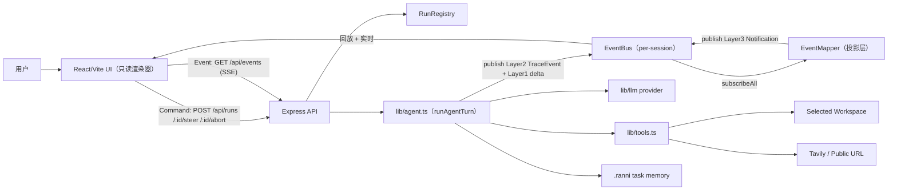
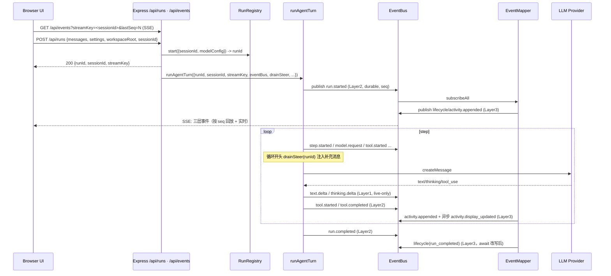

# Runtime Architecture

这份文档说明 Ranni 当前运行时架构：浏览器 UI、Express 服务端、事件总线、EventMapper、模型 provider、工具执行、workspace 边界和事件流如何协作。

Ranni 的通信层是**事件驱动 + 前后端解耦**架构（详见 `docs/tech/v2-architecture/`）：Command（HTTP REST）下发控制指令，SSE 单向下行广播事件，Agent 运行与 HTTP 请求生命周期彻底解耦。

## 总体结构



关键不变量：Command 与 Event 通道正交；durable 事件带 per-session 单调 `seq`、可回放；前端不再二次请求 LLM 改写 UI 文案。

## 前后端运行

开发模式：

- `npm run dev:frontend` 启动 Vite（默认 5173）。
- `npm run dev:backend` 启动 Express（默认 3001，可用 `BACKEND_PORT` 覆盖）。
- `npm run dev` 同时启动前后端。
- Vite dev server 代理 `/api` 和 `/health` 到 Express（读 `BACKEND_HOST` / `BACKEND_PORT`）。

生产模式：

- `npm run build` 构建前端（`dist/client`）和后端。
- `npm run start` 启动 Express，托管静态网页并提供 `/api/*`。

## Run 生命周期（Command + SSE）



`POST /api/runs` 是即发即忘的 Command：注册 run 后立即返回 `runId`，Agent 在后台异步运行；所有状态变化通过 SSE 事件流下发。前端在发送前就建立 session 级 EventSource，因此即使启动与订阅顺序颠倒，EventBus 的 durable 事件回放也能补齐。

## 三层事件与三段式

事件分三层（定义见 `lib/events/schema.ts`）：

- **Layer 1 ProviderEvent**（live-only，不分配 seq、不入 buffer）：`text.delta`、`thinking.delta`，用于前端流式打字。
- **Layer 2 TraceEvent**（durable，带 seq、可回放）：`run.started/completed`、`step.started/completed`、`tool.started/completed`、`text.started/completed`、`thinking.started/completed`、`model.request/response`、`context.snapshot`、`task.state`、`research.state`、`run.status`。
- **Layer 3 ClientNotification**（durable，前端 UI 主消费）：`activity.appended`、`activity.display_updated`、`assistant.message`、`lifecycle`、`research.context.updated`、`thinking.message`、`error`。

文本类事件遵循三段式：`text.started`（durable，携带后端生成的 `textId`）→ `text.delta`（live-only）→ `text.completed`（durable，完整文本边界）；thinking 同理。`textId` / `thinkingId` 让前端在断线重连后能按 id 续接流，避免半截消息错位。

## EventBus 与 Event Sourcing

`lib/events/event-bus.ts` 是进程内单例，按 `streamKey`（=sessionId）组织事件流：

- `publish(streamKey, event, { durable })`：durable 分配 per-streamKey 单调 `seq` 并写入 ring buffer（容量 2000），live-only 仅广播。
- `subscribe(streamKey, fromSeq, cb)`：同步回放 buffer 中 `seq > fromSeq` 的 durable 事件，再切到实时。JS 单线程下同步回放与注册之间无并发缺口，天然不丢事件。
- `subscribeAll(cb)`：供 EventMapper 消费所有 streamKey 的 Layer2 事件。

持久化范围是**进程内内存 ring buffer**（重启即丢），满足断线续传/重连回放；TraceRun 的跨重启持久化仍由前端 localStorage 维持。

## EventMapper（展示逻辑后移）

`lib/runs/event-mapper.ts` 订阅所有 Layer2 TraceEvent，投影为 Layer3 ClientNotification 发回同一 streamKey：

- `tool.started` → 立即发 `activity.appended`（display=fallback），并**在后端异步调用 LLM** 生成 model display，完成后发 `activity.display_updated`。前端不再二次请求 `/api/activity/describe` 改写文案。
- `run.completed` 前 await 本 run 未完成的改写（8s 超时），保证 display_updated 在 run 结束前落地。
- `task.state` 按 `currentMode|nextAction|verification.status` 签名去重。
- `research.state` → `activity.appended(research)` + `research.context.updated`（驱动前端 researchContext）。
- `thinking.completed` → `thinking.message`（驱动前端 thinking feed 定稿）。
- 其余 Layer3 由对应 Layer2 投影。

mapper 只认 Layer2 type，忽略自身产出的 Layer3 与 Layer1，避免自循环。

## Steering Queue（执行中补充消息）

`lib/runs/run-registry.ts` 为每个 run 维护 `steerQueue`。`POST /api/runs/:id/steer` 把消息入队（即发即忘）。`runAgentTurn` 在每个 step 循环开头（发起下一次 LLM 请求前）调 `drainSteer(runId)` 抽取队列消息注入 conversation，并 emit 一条 `run.status` 告知前端「已接收补充消息」。这让「执行中补充消息」通过普通 HTTP POST 完成，无需全双工通道。

## Agent Run 并发限制

前端按 session 维护正在运行的 agent 请求，最多允许 3 个 run 同时进行。运行中 session 的输入框变为「补充消息（steer）」入口；切换到其他 session 后仍可发起新 run，直到达到并发上限。

服务端在 `POST /api/runs` 中通过 `RunRegistry.activeCount()` 维护进程内 active run 计数。达到 3 时返回 `429`：

```json
{
  "errorCode": "AGENT_CONCURRENCY_LIMIT",
  "error": "同时进行的任务数量已达上限，请等待已有任务完成后再试。",
  "activeCount": 3,
  "limit": 3
}
```

前端识别 `AGENT_CONCURRENCY_LIMIT` 后打开任务上限弹窗。run 完成、失败或取消后释放 slot。

## Workspace 边界

每个 session 有自己的 `workspaceRoot`。发送首条消息或点击自动开始时，后端会在 `RANNI_DEFAULT_WORKSPACE` 下创建 session 专属目录，后续 `/api/runs` 请求都会携带这个路径。

服务端在 `POST /api/runs` 中要求传入 `workspaceRoot`，并校验目录存在、位于默认 session 根目录下，且目录名符合 `ranni-session-*`。工具层通过 `resolveWorkspacePath` 把相对路径解析到 session 专属 workspace 内，并拒绝越界路径。

受 workspace 约束的能力：

- 文件列表、读取、写入、移动、删除。
- 文件内容搜索。
- 终端命令 cwd。
- research notebook。
- `.ranni` task memory。

`AGENT_WORKSPACE_ROOT` 只保留给低层工具后备和调试场景。产品主路径里，`/api/runs` 缺少 session workspace 会被拒绝。

## Abort 传播

用户点击终止后：

1. 前端 `POST /api/runs/:runId/abort`（Command 通道）。
2. `RunRegistry.abort(runId)` 触发该 run 的 `AbortController.abort()`，清空 steerQueue。
3. `runAgentTurn` 收到 signal。
4. 模型请求、retry sleep、工具调用、终端子进程检查 signal。
5. Run 和当前 step 标记为 `cancelled`，发 `run.completed(cancelled)`。

EventSource 是 session 级长连接，不受 run 级 abort 影响；abort 后 `lifecycle(run_completed)` 通知前端清理 activeRequest。

## Provider 运行时

`lib/llm/index.ts` 根据 `modelConfig.provider`、`LLM_PROVIDER` 或默认值选择 provider。

前端设置会构造：

```ts
{
  provider,
  apiKey,
  baseUrl,
  model
}
```

服务端也可以从环境变量读取 key 和默认值。

OpenAI provider 走官方 `https://api.openai.com/v1/chat/completions`，默认模型是 `gpt-5.5`，并使用 `max_completion_tokens` 适配 OpenAI Chat Completions 当前参数名。它读取 `OPENAI_BASE_URL` / `OPENAI_MODEL`，避免误用其他 provider 的 `LLM_BASE_URL` / `LLM_MODEL`。

Computer use 属于工具层能力。`operate_computer` 使用 OpenAI Responses API 的 `computer` tool，默认模型 `gpt-5.5`，key 从前端 tool settings、`OPENAI_COMPUTER_API_KEY` 或 `OPENAI_API_KEY` 读取。模型返回 `computer_call` 后，Node 后端通过 macOS 适配器执行截图、点击、滚动、输入、按键和拖拽，再以 `computer_call_output` 回传 `computer_screenshot`。这条链路控制的是用户实际桌面，需要 Screen Recording 和 Accessibility 权限，也会在敏感或破坏性操作前停止。

DeepSeek thinking mode 的特殊点：

- 请求会包含 `thinking: { type: "enabled" }` 和 `reasoning_effort`。
- 后续历史中的 assistant thinking 会作为 `reasoning_content` 回传。
- 这是 DeepSeek API 协议要求，不只是 UI 展示字段。

OpenAI 兼容 provider 的流式解析（`lib/llm/providers/openai-compatible.ts`）会按行拆分单个 `data:` 块里的多条 JSON（`splitSseDataMessages`），兼容把多条 chunk 或 `[DONE]` 拼在同一块的供应商。

## Trace Export

Trace 导出是 session 级能力。点击顶部 `导出 trace` 时，前端直接导出当前 session 快照，不依赖某条 assistant 消息或最终回答是否已经产生。

导出文件包含：

- Export 时间。
- Session ID、title、workspace。
- Session messages。
- Process feed。
- Research context。
- 完整 trace runs JSON，包括 running / failed / cancelled / completed run。

文件名使用时间戳，例如：

```text
2026-05-04T08-15-58-018Z-trace.txt
```

## 运行期文件

Ranni 会在 session 专属 workspace 下写入运行期文件：

- `.ranni/`：task state、todo、verification、evidence、sources、checkpoints。
- `.ranni/runs/<runId>/source-ledger.md`、`claim-ledger.md`、`coverage-matrix.md`、`synthesis-brief.md`：deep research 中间记忆。
- `research/`：research notebook 和 research eval 输出。

它们都被 `.gitignore` 忽略。
