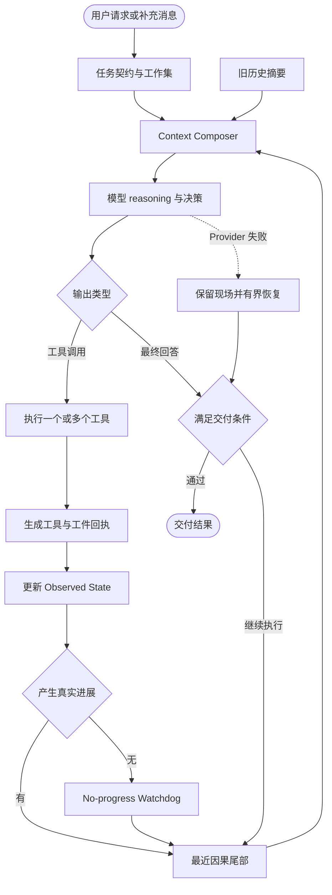

# Ranni 通用 Agent Harness：Skill、Context 与可观测性统一开发方案

> 状态：开发方案草案
>
> 范围：通用 Agent Harness、Skill Runtime、Context Composer、状态与进展、恢复与完成、Event Log、Step 输入输出查看器
>
> 核心原则：Guard invariants, expose reality, preserve agency

## 0. 文档目的

这份文档把三项紧密相关的优化统一成一套可施工的架构方案：

1. 支持动态 Skill 的通用 Agent Harness。
2. 保证每轮 reasoning、工具调用、工具结果连续可见的 Context 维护机制。
3. 让开发者能够查看每个 Step 实际输入和输出的前端可观测性能力。

文档先建立全貌，再逐层展开数据结构、运行流程、代码落点、施工批次和验收标准。读者可以只阅读前四章理解整体设计，也可以继续阅读后续章节进入实现细节。

本方案建立在 Ranni 已有能力之上：

- 本地优先的多 Session 工作台。
- Command + SSE 的事件驱动运行架构。
- Run 内动态 Skill 加载。
- Tool Call / Tool Result、多 Provider thinking、Task Memory 和 Trace。
- HTML-to-PPTX 等带专属工具与工件防线的重型 Skill。

## 1. 一页看懂整体方案

### 1.1 一句话定义

Ranni Harness 负责把用户目标、模型、Skill、工具、运行事实、上下文和交付条件组织成一个连续的闭环；模型负责在真实、连续、可观察的工作环境中自主选择策略。

```text
Agent = Model + Harness + Skill Runtime + Tools + Workspace Reality
```

### 1.2 Harness 与模型的责任边界

Harness 负责以下不可妥协的事实：

- 用户目标、交付物和授权边界不能在运行中丢失。
- 上一轮 reasoning、tool call、tool result 必须在下一轮保持连续。
- 文件、工件、命令、验证和错误状态来自客观回执。
- Skill 的加载、工具暴露和资源边界具有稳定语义。
- 无进展循环能够被识别、解释和有界终止。
- Provider 故障不会把未完成工件误判为可交付结果。
- 每个 Step 的实际输入、输出和裁剪决策可以审计。

模型保留以下自主空间：

- 是否先研究、读取、规划、修改或验证。
- 选择哪些工具，以及是否并行调用。
- 失败后采用 patch、重写、换来源或调整策略。
- 如何组织页面、代码、报告和最终回答。
- 何时需要加载新的 Skill 或参考资料。

### 1.3 目标运行闭环



### 1.4 方案的核心变化

| 关注点 | 目标设计 |
| --- | --- |
| Context | 最近完整因果尾部拥有最高保留优先级；较老历史按预算压缩 |
| State | Task Contract、Observed State、Agent Note 分责维护 |
| Progress | 以证据、文件、工件和验证增量衡量真实进展 |
| Skill | Skill 提供知识、工具和资源；运行阶段不裁剪模型所需的安全观察能力 |
| Guard | 保护权限、协议、状态、工件和完成条件，不规定模型的具体步骤 |
| Recovery | 保留当前现场，根据 Deliverable Contract 决定恢复方向 |
| Trace | Event Log 保存完整事实，Step I/O 保存实际请求与响应的语义快照 |
| UI | 主消息流保持简洁；运行详情页提供结构化 Step 输入输出查看器 |

## 2. 为什么需要这轮改造

### 2.1 典型失败表现

在一次使用 `gpt-5.6-sol` 执行 GLM-5.2 研究与 PPTX 制作的 Run 中，Trace 显示：

- 265 个主模型 Step。
- 516 次工具调用。
- 总耗时约 83 分钟。
- 最大单轮上下文占用仅 14.57%。
- 130 个 Step 只调用 `update_task_state`。
- 三段连续状态空转合计 112 Step，耗时约 43.3 分钟。
- `write_style_fragment`、`write_slide_fragment`、导出和验证工具调用数全部为 0。
- 末尾由 `terminated` 与 `fetch failed` 结束运行。

这组数据说明模型基础研究和并行工具调用能力已经工作，但 Harness 在 Context 投影、状态维护、进展判断和恢复条件上放大了一次错误选择。

### 2.2 关键失败链

```text
研究完成并初始化 workspace
→ artifact phase 立即启用强投影
→ 最新 reasoning 与多类工具结果被移除
→ 旧 reasoning 和少量旧观察持续回放
→ 模型每轮重新判断“编辑前先更新状态”
→ update_task_state 技术成功但没有外部进展
→ Runtime 没有消费 no-progress 信号
→ 状态循环持续数十轮
→ Provider 最终出现瞬时故障
→ Recovery 在工件未完成时切入 final synthesis
```

### 2.3 暴露出的通用问题

这次问题超出了 PPTX Skill 本身，涉及通用 Agent Harness：

1. Context 投影按工具白名单和 target 去重，破坏了最近因果连续性。
2. Phase 切换和上下文压缩耦合，在窗口压力很低时删除大量历史。
3. 模型维护的 TaskState 与 Harness 观察到的运行事实混合在一起。
4. 工具技术成功被当作任务进展，状态维护可以无限续命。
5. Skill 工件阶段移除研究记录和通用恢复工具，能力边界过早收窄。
6. Recovery 只检查研究证据，没有检查用户要求的实际工件。
7. 前端拥有原始 Trace，但缺少对每轮 Input / Output 的结构化解释。
8. 辅助 LLM 请求与主 Agent 共用 Provider，却没有独立预算和 Trace 分类。

## 3. 核心概念与统一术语

后续开发、文档和 UI 使用以下术语。

### 3.1 Run

用户一次提交触发的一次完整 Agent 执行。Run 可以包含多个 Step、多个 Skill、多个工具调用和一个最终交付结果。

### 3.2 Step

一次主模型请求及其后续输出处理边界。

```text
Step N
= 组装 Input
+ 请求主模型
+ 收集 reasoning / text / tool calls
+ 执行该轮工具
+ 收集 tool results
+ 生成 Progress Receipt
```

一个 Step 可以包含多个并行工具调用。Activity Rewrite、标题生成、Judge 等辅助请求单独计数，不进入主 Step 数量。

### 3.3 Causal Turn

一个不可拆散的因果单元：

```text
assistant reasoning
→ assistant tool calls
→ tool results
→ progress receipt
```

最近 Causal Turn 必须作为整体进入下一轮模型输入。

### 3.4 Task Contract

由用户意图派生的稳定任务契约：

- goal
- deliverable
- constraints
- success criteria
- authorization boundary

Task Contract 主要由用户消息和 Harness 维护，模型可以提出澄清或调整建议。

### 3.5 Observed State

由 Harness 根据运行现实维护的状态：

- 实际文件和 hash。
- 命令退出码。
- Tool Receipt。
- Research finding 与 source ledger。
- draft / accepted artifact。
- 导出和验证状态。
- 未解决错误。

语言声明不能覆盖 Observed State。

### 3.6 Agent Note

模型可维护的轻量工作判断：

- current intent
- next action
- assumptions
- open questions

Agent Note 用于表达模型当前策略，不承担文件、工件和验证事实的权威记录。

### 3.7 Working Set

Context Composer 在每轮请求前生成的当前工作视图：

- Task Contract 摘要。
- Agent Note。
- 最新 Observed State。
- 当前 artifact。
- Research Handoff。
- 未解决失败。
- Deliverable Contract。

### 3.8 Event Log 与 Archive

Event Log 是完整、追加写入、可回放的运行事实。Archive 是从较老 Event Log 派生的压缩摘要和引用。

### 3.9 Tool Receipt

每次工具执行后由 Harness 生成的结构化回执，包括：

- 工具名和 toolUseId。
- 输入摘要与输入 hash。
- 成功或失败。
- 结果摘要与结果 hash。
- 文件、工件、证据和验证增量。
- 完整结果引用。

### 3.10 Progress Receipt

每个 Step 结束时由 Harness 生成的真实进展判断。它回答三个问题：

1. 这一轮改变了什么外部事实？
2. 这一轮是否产生新证据或新诊断？
3. 无进展连续轮数是多少？

### 3.11 Deliverable Contract

用户交付要求的机器可检查表达，例如：

```json
{
  "type": "pptx",
  "requiredArtifacts": ["manifest", "styles", "slides", "pptx"],
  "verificationRequired": true
}
```

### 3.12 Skill Runtime

Run 内负责 Skill 索引、激活状态、正文指令、专属工具和资源的运行机制。

## 4. 通用 Agent Harness 全貌

### 4.1 运行层次

```text
用户与产品层
├── 用户消息
├── Steering
├── Skill 开关
└── Step 输入输出查看器

Agent Harness
├── Run Controller
├── Context Composer
├── Skill Runtime
├── Tool Executor
├── Receipt Registry
├── Progress Watchdog
├── Completion Guard
└── Recovery Controller

状态与事实层
├── Task Contract
├── Agent Note
├── Observed State
├── Event Log
├── Task Memory
└── Workspace Artifacts

模型与外部能力
├── Model Provider
├── Filesystem / Terminal
├── Search / Fetch
├── Computer Use
├── Research Tools
└── Skill Tools
```

### 4.2 主循环伪代码

```ts
for (const step of runBudget) {
  const steering = drainSteeringMessages(runId);
  const observedState = receiptRegistry.snapshot();
  const workingSet = buildWorkingSet({
    taskContract,
    agentNote,
    observedState,
    activeSkills,
    deliverableContract,
  });

  const contextEnvelope = contextComposer.compose({
    systemInstructions,
    workingSet,
    recentCausalTail,
    archiveSummary,
    steering,
    toolDefinitions,
    runtimeBudget,
  });

  emitContextSnapshot(contextEnvelope);
  const modelResponse = await requestMainModel(contextEnvelope);

  if (modelResponse.hasToolCalls) {
    const toolResults = await executeToolBatch(modelResponse.toolCalls);
    const toolReceipts = receiptRegistry.record(toolResults);
    const progressReceipt = progressTracker.evaluate(toolReceipts);
    recentCausalTail.append(
      closeCausalTurn(modelResponse, toolResults, progressReceipt),
    );
    await noProgressWatchdog.observe(progressReceipt);
    continue;
  }

  const completion = completionGuard.evaluate({
    modelResponse,
    deliverableContract,
    observedState: receiptRegistry.snapshot(),
  });

  if (completion.ready) {
    return finalizeRun(modelResponse, completion);
  }

  recentCausalTail.append(completion.feedbackTurn);
}
```

### 4.3 Less structure, more intelligence 的落地方式

本方案不新增固定的 research → plan → act → verify 状态机。`currentMode` 继续表达认知姿态和 UI 信息，不决定安全观察工具的可用性。

Runtime 只守护以下边界：

- 因果链完整。
- 运行事实真实。
- 权限与工作区安全。
- 工件写入和 promote 原子。
- 无进展有界。
- 完成条件可核验。
- 恢复不改变用户目标。

模型仍然可以自由组合研究、读取、修改、验证和恢复动作。

## 5. Context Composer V2

### 5.1 Context 的四层结构

每次主模型请求由四层 Context 组成。

| 层 | 主要内容 | 生命周期 | 保留优先级 |
| --- | --- | --- | --- |
| Task Contract | 目标、交付物、约束、成功条件 | 整个 Run | 最高 |
| Working Set | 当前意图、Observed State、artifact、失败、handoff | 每轮重建 | 最高 |
| Recent Causal Tail | 最近 2–4 个完整 Causal Turn | 滑动窗口 | 最高 |
| Archive Summary | 更早历史的摘要和引用 | 按预算更新 | 可压缩 |

Steering Messages 在下一轮边界注入，并同步更新 Task Contract 或 Working Set。

### 5.2 每轮 Input Envelope

```ts
type ContextEnvelope = {
  stepIndex: number;
  systemPrompt: string;
  taskContract: TaskContractView;
  workingSet: WorkingSetView;
  archiveSummary: ArchiveSummaryView;
  causalTail: CausalTurn[];
  steeringMessages: AgentMessage[];
  toolDefinitions: TraceToolDefinition[];
  composition: ContextCompositionManifest;
};
```

发送给 Provider 的逻辑顺序：

```text
System Prompt
→ Task Contract
→ Working Set
→ Archive Summary
→ Recent Causal Tail
→ 最新 Steering Messages
→ Tool Definitions
```

### 5.3 Causal Turn 的原子性

```ts
type CausalTurn = {
  stepId: string;
  stepIndex: number;
  assistant: {
    reasoning: unknown[];
    visibleThinking: string;
    text: string;
    toolCalls: TraceToolCall[];
  };
  toolResults: TraceToolResult[];
  progressReceipt: StepProgressReceipt;
};
```

约束：

1. Step N 的全部 tool call 和 result 在 Step N+1 中至少出现一次。
2. 并行工具批次整体保留，不能按 path、target 或工具白名单裁掉其中一部分。
3. 单个结果过大时，保留调用、状态、摘要、hash 和完整引用；正文可以按确定性规则截断。
4. Tool call/result 配对失败时停止发起下一次模型请求，并进入协议恢复。
5. 最近一轮拥有最高优先级，任何 phase 切换都不能移除它。

### 5.4 Provider reasoning 的维护

不同 Provider 对 reasoning 的协议要求不同：

- DeepSeek thinking 需要在后续工具轮次回传 reasoning content。
- ChatGPT Subscription Responses 需要回传 opaque reasoning item、function call 和 function call output。
- 部分 Provider 只提供可见 thinking 文本或完全不提供 thinking。

Context Composer 需要同时维护两种表示：

1. Provider Continuation Payload：满足 Provider 协议的原始或 opaque 项，只在最近因果尾部中使用。
2. Human-readable Thinking：用于 UI、Trace 和较老历史摘要。

旧 Causal Turn 移入 Archive 时，移除 Provider continuation metadata，保留决策摘要、调用和结果。这样可以避免几十轮前的 reasoning 被当成当前续写状态。

### 5.5 Context Composition Manifest

每次组装都生成可审计清单：

```ts
type ContextCompositionManifest = {
  version: 2;
  originalMessageCount: number;
  finalMessageCount: number;
  estimatedInputTokens: number;
  safeInputBudget: number;
  compactionApplied: boolean;
  compactionReason?: "budget" | "provider-limit";
  previousTurnToolPairs: {
    expected: number;
    preserved: number;
  };
  recentCausalTurnCount: number;
  omittedHistoricalToolPairCount: number;
  staleReasoningItemCount: number;
  sections: TraceContextSection[];
  snapshotHash: string;
};
```

它既服务于 Trace，也服务于前端上下文健康检查。

### 5.6 动态 Token 预算

```text
Safe Input Budget
= Model Context Window
- Max Output Tokens
- Safety Margin
```

建议在 Safe Input Budget 使用到约 75% 时压缩较老历史。对于 1,050,000 context、128,000 max output 和 50,000 safety margin：

```text
Safe Input Budget = 872,000
Compaction Threshold ≈ 654,000
```

典型压缩顺序：

1. 删除 Archive 中重复细节。
2. 将旧工具正文替换为摘要和内容引用。
3. 合并已经完成的旧阶段。
4. 清理已经解决的问题和过时计划。
5. 保留最近 2–4 个完整 Causal Turn。

Task Contract、Working Set、上一轮完整 Causal Turn、当前未解决错误和当前 artifact 始终保留。

### 5.7 Context 组装失败防线

模型请求前执行以下确定性检查：

- 上一轮 tool call/result 数量一致。
- 上一轮所有 toolUseId 均有结果。
- Task Contract 存在。
- Deliverable Contract 存在或明确标记为 text-only。
- Context Snapshot hash 已生成。
- Provider continuation payload 符合当前适配器要求。
- Input 低于 Safe Input Budget。

检查失败时记录结构化错误并进入恢复，不把不完整 Input 发送给模型。

## 6. 状态、回执与真实进展

### 6.1 状态分层

#### Task Contract

稳定表达用户意图，用户消息拥有最高优先级。

#### Observed State

由 Receipt Registry 自动生成：

```ts
type ObservedState = {
  files: Record<string, FileReceipt>;
  commands: CommandReceipt[];
  evidence: EvidenceReceipt[];
  artifacts: Record<string, ArtifactReceipt>;
  verification: VerificationReceipt[];
  unresolvedErrors: ErrorReceipt[];
};
```

#### Agent Note

只保存模型当前策略：

```ts
type AgentNote = {
  currentIntent?: string;
  nextAction?: string;
  assumptions?: string[];
  openQuestions?: string[];
};
```

### 6.2 `update_task_state` 的新语义

保留该工具用于兼容和策略表达，但改为 delta patch：

```json
{
  "nextAction": "写入 Manifest"
}
```

返回：

```json
{
  "changedFields": ["nextAction"],
  "stateHash": "abc123",
  "noChange": false
}
```

同义或无效更新返回 `noChange: true`。工具说明中移除“编辑前使用”等仪式化引导。Task Contract 和 Observed State 的权威字段不允许被该工具覆盖。

### 6.3 Progress Receipt

```ts
type StepProgressReceipt = {
  progress: boolean;
  category:
    | "evidence"
    | "artifact"
    | "verification"
    | "diagnostic"
    | "unchanged"
    | "failed"
    | "recovery"
    | "final";
  deltas: string[];
  noProgressStreak: number;
  stateHash: string;
  artifactHash?: string;
};
```

以下变化计为真实进展：

- 新增 evidence、finding、source 或 claim。
- 文件内容 hash 改变。
- artifact 从 pending 变为 draft、accepted、exported 或 validated。
- 新增验证结果。
- 首次出现具有诊断价值的失败。
- 用户提供新的约束、答案或授权。

以下行为不增加进展计数：

- 同义改写 Agent Note。
- 重复读取未变化文件。
- 相同搜索返回相同结果。
- 重复报告同一个错误。
- 只改变 next action 文本，没有外部事实变化。

### 6.4 No-progress Watchdog

Watchdog 只在客观无进展持续发生时介入。

#### 连续 3 轮

向模型注入事实性诊断：

```text
最近三轮没有新增证据、文件变化、工件变化或验证结果。
重复策略：update_task_state。
当前交付缺口：manifest pending。
请重新评估策略，选择能够改变外部状态的动作，或说明明确阻塞。
```

#### 连续 6 轮

- 保留完整 Recent Causal Tail。
- 发起一次策略重置请求。
- 对已经连续返回 `noChange` 的维护性工具暂时降权或隐藏一轮。
- 继续开放安全观察、工件、研究和验证工具。

#### 连续 10 轮

- 保存 checkpoint。
- 终止当前无进展循环。
- 返回已完成内容、阻塞条件、最近失败和恢复入口。

原有最大 500 Step 继续作为紧急上限。时间、Token 和辅助请求预算也应单独可观测。

## 7. 通用 Skill Runtime

### 7.1 两层加载模型

Skill 继续采用两层知识模型：

| 层 | 内容 | 进入 Context 的条件 |
| --- | --- | --- |
| Skill Index | name、description、版本、能力摘要 | Run 常驻 |
| Skill Body | SKILL.md 正文、references、专属工具、资源 | 用户强制加载或 Agent 激活 |

Skill Body 进入 system prompt，深度 references 通过读取工具按需进入，scripts 和 templates 由工具执行时引用。

### 7.2 Skill 激活与 Context 的关系

Skill 激活后：

1. Skill 正文进入 System Prompt 的 Skill Instructions 区域。
2. Skill 专属工具加入 Tool Definitions。
3. Skill 资源路径加入只读资源索引。
4. Context Manifest 记录 skill name、version、body hash 和工具集合变化。
5. Run 内 Skill 保持已激活状态，避免知识和工具在中途消失。

用户显式开关与模型 `load_skill` 最终进入同一个 `activeSkills` 集合。

### 7.3 Skill 工具面保持稳定

Skill 可以提供工具推荐和工件约束，但 phase 不应删除 Agent 仍需使用的安全能力。

以下通用能力在重型 Skill 运行期间保持可用：

- `list_files`
- `read_file`
- `search_in_files`
- Task Memory 读取与必要更新
- `search_web`
- `fetch_url`
- Research ledger 记录
- Artifact inspect
- 与当前任务相关的验证工具

写入、删除、终端、桌面操作和外部影响继续经过 workspace、权限和 side-effect 防线。

### 7.4 Research Handoff

研究型任务转入工件制作时，Harness 自动生成固定的 Research Handoff：

```ts
type ResearchHandoff = {
  thesis: string;
  findings: Array<{ id: string; summary: string }>;
  sourceIds: string[];
  claimIds: string[];
  artifactPlan: string[];
  openGaps: string[];
  weakEvidence: string[];
};
```

Handoff 固定进入 Working Set，直到相关 artifact 完成。后续搜索和 fetch 仍然可以更新 ledger，更新后的 delta 会进入下一轮 Recent Causal Tail。

### 7.5 Artifact Guard 的职责

Artifact Guard 负责：

- manifest 结构。
- draft / accepted 生命周期。
- 文件和 hash 一致性。
- 写入完整性。
- prepare / export / validate 前置条件。
- 失败 draft 不覆盖 accepted。

Artifact Guard 不负责决定模型必须先做哪一步，也不以 phase 为理由压缩 Context 或隐藏安全观察工具。

### 7.6 HTML-to-PPTX 示例

```text
研究与证据完成
→ 生成 Research Handoff
→ 初始化 slide workspace
→ 写入 manifest
→ 写入并组装 styles
→ 写入、inspect、patch slide fragments
→ assemble deck
→ prepare
→ export PPTX
→ validate
→ Completion Guard 检查 Deliverable Contract
```

模型可以在任意安全节点回到研究、读取、诊断或修改。Harness 只根据工具回执更新工件状态。

## 8. 完成、恢复与辅助请求

### 8.1 Completion Guard

最终回答前检查：

- Deliverable Contract 的必需工件存在。
- artifact hash 与 accepted receipt 一致。
- 必需验证已经通过。
- manifest、页面集合、导出结果一致。
- 没有覆盖交付物的 unresolved hard error。
- 用户要求的最终文字说明已经准备好。

条件未满足时，把客观缺口作为一个新的 Guard Turn 放入 Recent Causal Tail，继续执行。

### 8.2 Provider Failure Recovery

模型请求发生 `terminated`、`fetch failed`、timeout 或连接错误时：

1. 冻结当前 Context Envelope 和 snapshot hash。
2. 保存 Agent Note、Observed State、Causal Tail 和 artifact receipts。
3. 执行少量有界重试和退避。
4. 检查 Deliverable Contract。
5. 交付已完成时进入 final recovery。
6. 交付仍有缺口时恢复执行或返回可恢复 checkpoint。

恢复流程不能清空已经建立的 Causal Tail，也不能在工件 pending 时禁止工具调用。

### 8.3 Tool Protocol Recovery

以下情况进入协议恢复：

- Tool call JSON 截断或无法解析。
- Tool call/result 配对缺失。
- Provider-required reasoning item 丢失。
- 工具名不在当前 Tool Definitions。
- 结果超出单轮安全预算。

协议恢复优先保留模型已经完成的 reasoning 和有效工具调用，并返回准确错误事实。

### 8.4 Activity Rewrite 隔离

过程卡片文案默认使用确定性映射。确需模型改写时：

- 使用独立的轻量模型或 Provider。
- 使用独立队列和并发限制。
- 拥有独立超时、重试和 Token 预算。
- 主 Run 结束后可以取消。
- 不阻塞主模型请求。
- 在 Trace 中标记 `requestKind: activity_rewrite`。

所有模型请求按类别统计：

```text
main_agent
activity_rewrite
title_generation
judge
recovery
```

UI 的 Step 数只表示 `main_agent` 请求。

### 8.5 工具接口的人因优化

工具接口应减少模型因常见理解差异造成的机械失败。例如 `search_in_files` 同时接受文件和目录：

- 目录执行递归搜索。
- 文件执行单文件搜索。
- 路径不存在时返回结构化建议。

重复调用指纹至少包含：

```text
tool + path + query + glob + options + workspaceVersion
```

相同 workspace 版本下的完全重复查询可以返回缓存和 `unchanged: true`。

## 9. Event Log、Trace 与后端持久化

### 9.1 事件分层

保持现有三层事件模型：

1. Provider Event：模型流式 delta 和底层协议事件。
2. Trace Event：Run、Step、Context、请求、响应、工具、状态和回执的持久事实。
3. Client Notification：面向消息流和 UI 的投影。

新增或扩展以下 Trace Event：

- `context.snapshot`
- `model.request.started`
- `model.response.completed`
- `tool.batch.started`
- `tool.completed`
- `state.observed.updated`
- `progress.receipt`
- `step.completed`
- `recovery.started`
- `completion.checked`

### 9.2 Step I/O 数据模型

```ts
type TraceStepIO = {
  stepId: string;
  stepIndex: number;
  input: {
    envelope: ContextEnvelope;
    exactRequest: TraceModelRequest;
    snapshotHash: string;
  };
  output: {
    thinking: string;
    response?: TraceModelResponse;
    assistantText: string;
    toolCalls: TraceToolCall[];
    toolResults: TraceToolResult[];
    stateDelta: StateDelta;
    progressReceipt: StepProgressReceipt;
    error?: string;
  };
};
```

Input 在模型请求发出前冻结。Output 在 reasoning、tool 和 receipt 到达时增量补齐，Step 结束后封存。

### 9.3 存储布局

完整 Step Trace 不再只依赖前端 localStorage。建议保存在 Session workspace：

```text
.ranni/runs/<runId>/
├── run.json
├── step-index.json
├── trace.jsonl
└── steps/
    ├── 0001-input.json
    ├── 0001-output.json
    ├── 0002-input.json
    └── 0002-output.json
```

职责：

- `trace.jsonl`：完整追加 Event Log。
- `step-index.json`：轻量 Step 摘要，用于列表和筛选。
- `steps/*-input.json`：实际 Input Snapshot 与 Context Manifest。
- `steps/*-output.json`：模型输出、工具配对、状态 delta 和 Progress Receipt。

写入采用增量追加和原子替换。API Key、Authorization Header 和其他敏感字段在落盘前脱敏。

### 9.4 查询 API

建议增加：

```text
GET /api/sessions/:sessionId/runs
GET /api/runs/:runId/steps?cursor=&filter=
GET /api/runs/:runId/steps/:stepId/io
GET /api/runs/:runId/steps/:stepId/raw
GET /api/runs/:runId/steps/:stepId/diff?against=previous
```

前端先加载 Step 索引，选中后按需加载详细 I/O。运行中的 Step 继续通过 SSE 增量更新。

### 9.5 老 Trace 兼容

旧 Trace 缺少 semantic sections 和 Progress Receipt 时：

- 使用现有 system prompt、messages、tools、request、response 和 tool records。
- UI 标记 `Legacy Trace`。
- 输入页展示可确定的顶层区块。
- 上下文健康检查中将无法计算的字段标记为 unknown。
- 原始数据仍然可以查看和导出。

## 10. Step 输入输出查看器

### 10.1 产品位置

完整查看器放在现有「运行详情页」。

「运行状态栏」承担摘要和入口：

```text
当前 Step 150
Input       28.7k
Output      814
结果        no progress
因果尾部    完整
上下文占用  2.7%

[查看 Step 输入输出]
```

消息流不增加新的调试卡片。现有过程项的信息按钮可以深链到对应 Step。

### 10.2 页面布局

```text
┌──────────────────────────────────────────────────────────────────┐
│ Run #3 · Step 150 · Completed · 28.7k → 814 · 31.2s             │
│ Progress: No change · Context: 2.7% · Causal integrity: Warning  │
├──────────────────┬───────────────────────────────────────────────┤
│ Run / Step 列表   │ [输入] [输出] [与上一轮对比] [原始数据]       │
│                  │                                               │
│ Step 147 失败     │ 上下文健康检查                                │
│ Step 148 +证据    │ 上一轮工具结果       1 / 1                    │
│ Step 149 状态     │ 最近因果轮次         3                        │
│ Step 150 无进展 ◀ │ 旧 Reasoning 回放    0                        │
│ Step 151 无进展   │ 被省略最近工具结果   0                        │
│                  │                                               │
│ 筛选              │ 输入构成列表                                  │
│ 全部 / 进展       │ ▸ System Prompt       24.1k tokens           │
│ 无进展 / 失败     │ ▸ Task Contract       1.2k tokens            │
│ 工件变化          │ ▾ Working Set         2.4k tokens            │
│                  │ ▾ Recent Causal Tail  3 steps                 │
│                  │ ▸ Archive Summary      4.1k tokens            │
│                  │ ▸ Available Tools      19 tools               │
└──────────────────┴───────────────────────────────────────────────┘
```

### 10.3 Step 列表

每个 Step 显示：

- 编号和状态。
- 耗时。
- Input / Output Token。
- Stop Reason。
- Progress Category。
- 主要工具或主要 artifact delta。

筛选项：

- 全部。
- 有进展。
- 无进展。
- 失败。
- 工件变化。
- Recovery。

支持按工具名、文件路径和文本搜索。长列表使用虚拟滚动。

### 10.4 输入页

输入页使用一层平铺的可折叠列表，固定顺序如下：

1. System Prompt。
2. Task Contract。
3. Working Set。
4. Recent Causal Tail。
5. Archive Summary。
6. Steering Messages。
7. Available Tools。
8. Context Composition。

每个顶层行显示：

```text
名称 · 项目数量 · token / chars · changed / unchanged · pinned / summarized
```

展开后显示语义条目，继续提供“查看原始内容”。

### 10.5 上下文健康检查

```text
上一轮完整工具结果        6 / 6
最近完整因果轮次          3
最新用户补充消息          1
旧 Reasoning Metadata     0
被省略历史工具调用        82
被省略最近工具调用        0
重复观察                  2
无进展连续轮数            3
压缩原因                  budget
```

健康检查只展示事实，不替代 Agent 的策略判断。

### 10.6 输出页

顶层平铺：

1. Thinking。
2. Assistant Text。
3. Tool Calls and Results。
4. State Delta。
5. Progress Receipt。
6. Completion Decision。
7. Error and Recovery。

Tool Call 和 Tool Result 按 toolUseId 配对。并行调用显示为同一批次，避免用户在两个 JSON 区块间手工查找。

### 10.7 与上一轮对比

默认使用确定性 Diff：

- Context Section 增删与 hash 变化。
- Token 和 message 数量变化。
- Tool Definitions 变化。
- 上一轮 tool pair 是否保留。
- Task Contract、Working Set 和 Agent Note 变化。
- State Delta、Artifact Delta 和 Progress Delta。

示例：

```text
Step 149 → Step 150

Input
+ System Prompt           +321 chars
= Task Contract           unchanged
= Working Set             semantically unchanged
- Tool Result             update_task_state missing

Output
= Next Action             写入 Manifest
= External Progress       false
= Tool Strategy           update_task_state
```

### 10.8 原始数据页

保留以下原始内容：

- Exact Model Request。
- Exact Model Response。
- Context Snapshot。
- Trace Events。
- Tool Definitions。
- Provider Metadata。

支持复制、下载当前 Step、下载 Step 区间和导出 JSON。所有内容沿用后端脱敏结果。

### 10.9 实时更新

正在运行的 Step 展示四个状态：

```text
Context ready
→ Model streaming
→ Tools running
→ Receipt finalized
```

Input Snapshot 在模型请求发出时冻结。Thinking、Tool Call、Tool Result 和 Progress Receipt 逐步补齐 Output。

### 10.10 UI 命名

实现时同步更新 `UI-NAMING.md`，新增：

- Step 输入输出查看器。
- 输入构成列表。
- 输入构成项。
- 输出构成列表。
- 输出构成项。
- 上下文健康检查。
- Step 对比。
- 原始数据。
- Progress Receipt。
- 因果链完整性。

## 11. 代码改造地图

| 文件或目录 | 主要职责与改动 |
| --- | --- |
| `lib/agent.ts` | 主循环、Context Composer 接入、Progress Watchdog、Completion 和 Recovery |
| `lib/active-context.ts` | 演进为 Context Composer V2，保留最近 Causal Turn，按预算压缩旧历史 |
| `lib/task-state.ts` | Task Contract、Agent Note、Observed State 的兼容与迁移 |
| `lib/task-memory.ts` | Working Set、Research Handoff、checkpoint 和 Archive 引用 |
| `lib/tools.ts` | delta state tool、统一 Tool Receipt、search interface 改进 |
| `lib/trace.ts` | Context Section、Composition Manifest、Progress Receipt、Step I/O 类型 |
| `lib/events/schema.ts` | 新增 progress、completion、recovery 等 durable event |
| `lib/events/legacy-map.ts` | 新旧事件兼容 |
| `lib/skills/registry.ts` | Skill 索引、版本、body hash、工具和资源元数据 |
| `lib/skills/runtime-instructions.ts` | Skill 正文进入 Context 的结构化表示 |
| `lib/runs/run-registry.ts` | Run budget、checkpoint、request kind 和取消 |
| `lib/runs/event-mapper.ts` | Trace 到 UI Notification 的确定性投影 |
| `lib/runs/activity-rewrite.ts` | 辅助请求隔离或默认停用 |
| `src/server/app.ts` | Step I/O 查询、Run Trace 持久化和导出 API |
| `components/agent-console.tsx` | 运行详情页重构、Step I/O 查看器、运行状态栏入口 |
| `components/agent-console.module.css` | 查看器布局、accordion、diff、health、虚拟列表样式 |
| `UI-NAMING.md` | 新增可见模块的统一命名 |
| `docs/tech/` | 更新 Harness、Skill、Context 和组件地图文档 |

实现时可以进一步拆分 `agent-console.tsx`，例如：

```text
components/run-inspector/
├── step-io-viewer.tsx
├── step-navigator.tsx
├── context-section-list.tsx
├── context-health.tsx
├── step-output-list.tsx
├── step-diff.tsx
└── raw-trace-view.tsx
```

## 12. 分批施工方案

施工批次用于控制代码变更风险，不映射为 Runtime 固定阶段。

### 第一批：因果正确性与恢复正确性

目标：先消除这次 112 轮状态循环的根因。

工作项：

1. 引入 `CausalTurn` 和 `ContextEnvelope`。
2. 下一轮无条件保留上一轮完整 tool call/result。
3. 移除 artifact phase 触发的强制压缩。
4. 压缩只由 Token 预算触发。
5. 清理旧 Provider reasoning metadata 回放。
6. Context Snapshot 增加 Composition Manifest。
7. Recovery 增加 Deliverable Contract 检查。
8. incomplete artifact 保留现场并恢复执行。

验收：

- Step N 的全部工具结果 100% 出现在 Step N+1 Input。
- 并行 8 个工具时完整保留 8 个结果。
- Phase 切换不会删除 Recent Causal Tail。
- 窗口占用低于阈值时不启用压缩。
- 工件 pending 时不会进入 final synthesis recovery。

### 第二批：状态、进展与 Skill 韧性

目标：让 Harness 识别真实推进，并保持 Skill 运行能力连续。

工作项：

1. 拆分 Task Contract、Observed State 和 Agent Note。
2. `update_task_state` 改为 delta patch 和 `noChange` 回执。
3. Tool Receipt 覆盖文件、命令、研究、artifact 和验证工具。
4. 实现 Progress Receipt。
5. 实现 3 / 6 / 10 轮 No-progress Watchdog。
6. Artifact Guard 移除过早的严格工具白名单。
7. 自动生成 Research Handoff。
8. `search_in_files` 支持文件和目录。
9. 辅助 LLM 请求与主 Agent 隔离。

验收：

- 同义状态更新返回 `noChange`。
- 状态维护不计为外部进展。
- state-only 连续调用在三轮后出现事实性诊断。
- Skill phase 变化后研究和安全观察能力仍可用。
- Research Handoff 在工件制作期间持续可见。
- 主请求和辅助请求可以独立统计。

### 第三批：持久化与 Step 可观测性

目标：让每轮真实输入输出可以低成本查看、对比和回放。

工作项：

1. 后端持久化 Step index、Input、Output 和 Event Log。
2. 增加 Step I/O 查询 API。
3. 重构运行详情页。
4. 增加结构化输入、输出、Diff 和 Raw Tabs。
5. 增加上下文健康检查。
6. 运行状态栏增加当前 Step 摘要和入口。
7. 支持筛选、搜索、虚拟列表和按需加载。
8. 兼容旧 Trace。

验收：

- Ranni 重启后仍能查看完整历史 Step。
- 260 个 Step 的列表滚动和切换保持流畅。
- 页面显示的 Input snapshot hash 与实际请求一致。
- 上下文健康检查能识别最近工具结果缺失。
- Tool Call 和 Result 可以一一配对查看。
- 原始数据导出经过脱敏。

## 13. 测试与评估策略

### 13.1 单元测试

#### Context Composer

- 保留上一轮全部 tool pairs。
- 同一路径不同 query 不互相覆盖。
- `search_web`、`fetch_url`、state、research 结果进入下一轮。
- Old reasoning metadata 不进入当前 continuation。
- Phase 切换不触发压缩。
- 大结果生成摘要和引用，同时保持配对完整。

#### State 与 Progress

- Agent Note delta 正确合并。
- 同义更新返回 `noChange`。
- Artifact hash 变化计为进展。
- 重复读取和重复搜索不计进展。
- 首次结构化失败计为 diagnostic，重复失败不重复计分。

#### Completion 与 Recovery

- 文本任务在 final text 完成后可交付。
- PPTX 缺少页面或验证时继续执行。
- Provider 失败保留 Causal Tail。
- Recovery 不删除工具和 artifact 状态。

### 13.2 集成测试

- 动态加载 Skill 后 system prompt 和工具集合同步变化。
- 一轮并行工具结果完整进入下一次 Provider 请求。
- Steering 在下一轮边界注入。
- Context Snapshot 与 exact request hash 一致。
- Step I/O 通过后端持久化并能在重启后读取。

### 13.3 Trace Replay 回归

将本次 265 Step 失败 Trace 提炼为可公开、无敏感数据的回归 fixture，重点回放：

- Step 30 → 31 的 phase 切换。
- 多工具研究结果的保留。
- 连续状态更新的 no-progress 判定。
- Provider 失败时的 Deliverable Contract 检查。

Replay 不需要真实调用模型，可以验证 Context 投影、Progress Receipt 和 Recovery 决策。

### 13.4 真实模型运行

使用同一 GLM-5.2 任务进行至少三次运行，记录：

- 主模型 Step 数。
- 辅助请求数。
- 首次 artifact mutation 的 Step。
- 最长无进展连续轮数。
- 重复搜索比例。
- 输入 Token / accepted slide。
- styles、slides、export、validation 完成率。
- Provider 中断后的恢复结果。

参考验收目标：

- 初始化 workspace 后 10 个主 Step 内产生真实 artifact mutation。
- 不出现超过 3 轮且没有 Watchdog 反馈的无进展序列。
- 不出现最近一轮 tool result 丢失。
- Provider 稳定时完成最终工件和验证。
- Provider 中断时保留可恢复 checkpoint。

### 13.5 前端测试

- Input / Output Tabs 展示完整。
- Accordion 展开收起保持状态。
- Step 切换不会混用前一 Step 数据。
- Live Step 增量更新没有重复。
- Diff 与 raw 数据一致。
- 260+ Step 虚拟列表性能达标。
- 窄屏通过运行状态栏浮层进入查看器。

## 14. 迁移与兼容策略

### 14.1 双轨 Trace

改造早期同时保留当前 Trace 字段和 V2 semantic fields。前端优先使用 V2，缺失时回退到 Legacy Raw View。

### 14.2 Context Composer 灰度

开发期可以使用内部开关：

```text
RANNI_CONTEXT_COMPOSER_V2=true
```

同时记录旧投影和新投影的摘要差异，但只把其中一个发送给模型。对比稳定后删除旧实现。

### 14.3 TaskState 兼容

旧 `TaskState` 可以通过适配器映射：

- goal、deliverable、constraints、success criteria → Task Contract。
- currentMode、nextAction、assumptions、openQuestions → Agent Note。
- filesTouched、commands、verification → 由 Receipt Registry 重建 Observed State。

### 14.4 存储与容量

完整 Input / Output 可能产生较大磁盘占用。建议：

- JSONL 追加写入。
- 大正文单独内容寻址存储。
- Step 文件按需压缩。
- 提供 Session 级清理入口。
- 长期保留摘要、hash 和关键回执。

## 15. 风险与应对

| 风险 | 应对 |
| --- | --- |
| Context V2 引入额外 Token | Working Set 保持简洁，Archive 按预算压缩，Manifest 不进入模型正文 |
| Provider reasoning 格式不同 | Provider adapter 维护 continuation codec，Context Composer 只处理统一表示 |
| Progress 误判 | 使用确定性 receipt 和 hash；无法确认时标记 unknown，不推测成功 |
| Watchdog 过度干预 | 只在连续客观无进展时介入，继续开放安全工具并保留模型选择权 |
| Skill 工具过多 | Skill Index 常驻，Skill Body 和专属工具按需加载 |
| Step Trace 数据量大 | 后端增量落盘、索引与详情分离、前端按需加载 |
| UI 信息密度过高 | 默认抽象列表，逐层展开，Raw View 放到最后一级 |
| 辅助请求影响主 Provider | 独立队列、模型、预算和 Trace 分类 |

## 16. 完成定义

本方案达到可交付状态需要同时满足：

### Harness

- Recent Causal Tail 在所有 Provider 下保持连续。
- Context 压缩只由预算触发。
- Task Contract、Observed State 和 Agent Note 分责生效。
- Progress Receipt 覆盖主要工具类型。
- No-progress Watchdog 能阻止长状态循环。
- Completion 和 Recovery 读取 Deliverable Contract。

### Skill

- 强制加载和自主加载使用统一 activeSkills 语义。
- Skill 正文、工具和资源变化进入 Context Manifest。
- Artifact Guard 保护工件事实，同时保留必要安全能力。
- Research Handoff 能跨研究和制作阶段持续存在。

### 可观测性

- 每个 Step 的实际 Input 和 Output 可查看、对比和导出。
- 上下文健康检查能够显示因果链完整性。
- 主模型请求与辅助请求分开计数。
- 历史 Step 在进程重启后可恢复。

### 质量

- 单元测试、集成测试和 Trace Replay 全部通过。
- `npm run typecheck`、`npm run lint`、`npm run build` 全部通过。
- 同一重型 Skill 任务的重复运行不再出现长时间无进展循环。
- 用户要求的最终工件经过客观验证后再宣告完成。

## 17. 与现有文档的关系

本文件作为后续开发的统一主入口，以下文档继续提供专题背景：

- `docs/tech/v1-architecture/core-concept/harness.md`：Harness 基础概念。
- `docs/tech/v1-architecture/agent-arch/architecture-defenses.md`：架构防线与 Agent 自主性的边界。
- `docs/tech/v2-architecture/skill-dynamic-loading-plan.md`：Skill 动态加载机制。
- `docs/tech/v2-architecture/Ranni 架构设计思想报告：事件驱动与前后端解耦.md`：事件驱动和前后端解耦。
- `docs/tech/v2-architecture/Ranni 架构重构实现参考手册.md`：事件和通信层实现参考。
- `docs/tech/v2-architecture/slides-html-pptx-optimization-construction-plan.md`：HTML-to-PPTX 专项优化。

后续代码落地后，应同步更新 README、组件地图、Harness 概念文档、UI 命名和相关 Skill 开发指南，使文档描述与当前运行事实保持一致。
