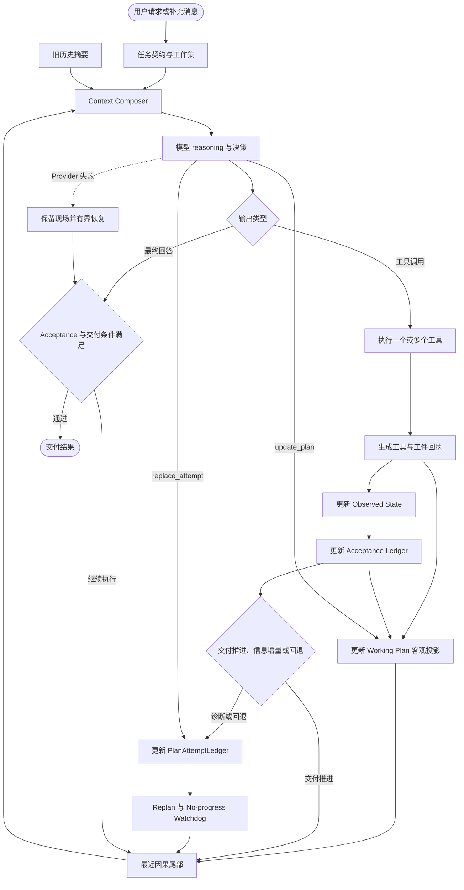

# Ranni 通用 Agent Harness：总览与共享契约

> 状态：核心架构、持久化 Trace、首批产品投影与真实运行验收已完成
>
> 文档角色：三文档套件的总入口、统一术语和共享契约
>
> 核心原则：Guard invariants, expose reality, preserve agency

## 文档导航

- 总览与共享契约（当前）
- [Runtime 与质量闭环](./02-runtime-and-quality.md)
- [可观测性与交付](./03-observability-and-delivery.md)

## 当前实施快照（2026-07-15）

本套文档继续作为共享契约与演进基线。当前代码已经完成以下核心迁移：

| 契约 | 当前落点 | 状态 |
| --- | --- | --- |
| 公共入口 | `lib/agent.ts` 仅保留稳定 facade；Server 与 research eval 继续调用 `runAgentTurn` | 已落地 |
| 运行边界 | `lib/agent/` 拆分 Run Controller、Step Runner、Tool Batch Executor、Finalization、Recovery、Event Sink 和 Run State | 已落地 |
| Context | `lib/context/composer.ts` 保留最近四个完整因果轮次，在 75% 安全输入预算阈值后压缩较老历史，并记录稳定前缀失效与可复用消息 | 已落地 |
| 状态与回执 | Receipt Registry、Observed State、Task Contract、Agent Note、Working Plan、Acceptance、Progress 和 Attempt 分责 | 已落地 |
| 计划与路线 | `lib/plan.ts` 维护 Plan Item、Plan Revision、Objective Projection 和 Plan Focus；`lib/plan-attempt.ts` 维护 Attempt 与 Assumption | 已落地 |
| Skill / Policy | Skill Index 记录 version、body hash 和资源；动态 Skill 会升级交付契约；PPTX、静态 HTML 与通用 workspace 工件通过 Policy 进入验收 | 已落地 |
| 完成与恢复 | PPTX 需要 validated 回执和精确页数；Provider 故障保留现场，缺口存在时返回 checkpoint；同 Session、同 workspace 的下一 Run 自动续接可恢复状态 | 已落地 |
| Event Log / Step I/O | workspace 中持久化 `trace.jsonl`、Run / Step 索引和输入输出文件，提供三个查询 API | 已落地 |
| 产品投影 | 运行概览、验收清单、交付缺口、完成依据、上下文健康和 Step 输入输出查看器消费持久化 API | 已落地 |

指定的 GLM-5.2 调研与八页新粗野风格 PPTX 任务已通过本地 Codex Provider 完整运行，最终 PPTX、八页渲染结果和验证回执均已检查。Runtime 已支持通过 `recoveryState` 重建 checkpoint 现场；产品级 checkpoint 选择与恢复控件、独立 Raw / Diff / 区间导出 API、完整分支树和并行路线比较继续演进。历史 Session 可以通过已选择的 workspaceRoot 重新发现磁盘 Run 与 Step I/O；长回答 chunked-final 已通过独立控制器接入新运行链路，完整聚合后才进入 Acceptance 验收。

## 0. 文档目的与阅读顺序

这套开发方案覆盖三项紧密相关的目标：

1. 支持动态 Skill 的通用 Agent Harness。
2. 保证每轮 reasoning、工具调用、工具结果连续可见的 Context 维护机制。
3. 让用户和开发者能够理解运行进展、完成依据以及每个 Step 的实际输入输出。

本文件负责整体设计、责任边界、统一术语和共享数据契约。实现 Agent Runtime、Context、状态、Skill、Completion 与 Recovery 时阅读《Runtime 与质量闭环》；实现 Event Log、Trace、API、运行概览、Step 查看器、施工批次和验收时阅读《可观测性与交付》。

共享类型和术语以本文件为准，另外两份文档引用这些契约，不重复建立同名概念。

本方案建立在 Ranni 已有能力之上：

- 本地优先的多 Session 工作台。
- Command + SSE 的事件驱动运行架构。
- Run 内动态 Skill 加载。
- Tool Call / Tool Result、多 Provider thinking、Task Memory 和 Trace。
- HTML-to-PPTX 等带专属工具与工件防线的重型 Skill。

## 1. 一页看懂整体方案

### 1.1 一句话定义

Ranni Harness 负责把用户目标、模型、Skill、工具、运行事实、上下文和交付条件组织成一个连续的闭环；模型负责在真实、连续、可观察的工作环境中自主选择策略。

```text
Agent = Model + Harness + Skill Runtime + Tools + Workspace Reality
```

### 1.2 Harness 与模型的责任边界

Harness 负责以下不可妥协的事实：

- 用户目标、交付物和授权边界不能在运行中丢失。
- 上一轮 reasoning、tool call、tool result 必须在下一轮保持连续。
- 文件、工件、命令、验证和错误状态来自客观回执。
- Skill 的加载、工具暴露和资源边界具有稳定语义。
- 失败路线、失效假设和无交付推进循环能够被识别、解释、替代和有界终止。
- 每项完成判定都能绑定外部证据或用户明确豁免。
- Provider 故障不会把未完成工件误判为可交付结果。
- 每个 Step 的实际输入、输出和裁剪决策可以审计。

模型保留以下自主空间：

- 是否先研究、读取、规划、修改或验证。
- 选择哪些工具，以及是否并行调用。
- 失败后采用 patch、重写、换来源或调整策略。
- 如何组织页面、代码、报告和最终回答。
- 何时需要加载新的 Skill 或参考资料。

### 1.3 目标运行闭环



### 1.4 方案的核心变化

| 关注点 | 目标设计 |
| --- | --- |
| Context | 最近完整因果尾部拥有最高保留优先级；较老历史按预算压缩 |
| State | Task Contract、Observed State、Agent Note 分责维护 |
| Plan | Plan Ledger 记录工作覆盖、稳定计划项、修订、客观投影和当前焦点 |
| Route | PlanAttemptLedger 记录当前具体方法、失败尝试、失效假设和替代关系 |
| Progress | 分别衡量交付推进、信息增量和结果回退，避免新错误持续伪装成进展 |
| Skill | Skill 提供知识、工具和资源；运行阶段不裁剪模型所需的安全观察能力 |
| Guard | 保护权限、协议、状态、工件和完成条件，不规定模型的具体步骤 |
| Completion | Deliverable Contract 定义要求，Acceptance Ledger 记录逐项验收和证据 |
| Recovery | 保留当前现场，根据交付缺口、Working Plan、当前 Attempt 和验收结果决定恢复方向 |
| Trace | Event Log 保存完整事实，Step I/O 保存实际请求与响应的语义快照 |
| Provider | Context Composer 保持统一语义，Provider Adapter 维护 continuation、compact 和稳定前缀 |
| UI | 主消息流保持简洁；运行详情页分为用户运行概览和开发者 Step 输入输出查看器 |

## 2. 为什么需要这轮改造

### 2.1 典型失败表现

在一次使用 `gpt-5.6-sol` 执行 GLM-5.2 研究与 PPTX 制作的 Run 中，Trace 显示：

- 265 个主模型 Step。
- 516 次工具调用。
- 总耗时约 83 分钟。
- 最大单轮上下文占用仅 14.57%。
- 130 个 Step 只调用 `update_task_state`。
- 三段连续状态空转合计 112 Step，耗时约 43.3 分钟。
- `write_style_fragment`、`write_slide_fragment`、导出和验证工具调用数全部为 0。
- 末尾由 `terminated` 与 `fetch failed` 结束运行。

这组数据说明模型基础研究和并行工具调用能力已经工作，但 Harness 在 Context 投影、状态维护、进展判断和恢复条件上放大了一次错误选择。

### 2.2 关键失败链

```text
研究完成并初始化 workspace
→ artifact phase 立即启用强投影
→ 最新 reasoning 与多类工具结果被移除
→ 旧 reasoning 和少量旧观察持续回放
→ 模型每轮重新判断“编辑前先更新状态”
→ update_task_state 技术成功但没有外部进展
→ Runtime 没有消费 no-progress 信号
→ 状态循环持续数十轮
→ Provider 最终出现瞬时故障
→ Recovery 在工件未完成时切入 final synthesis
```

### 2.3 暴露出的通用问题

这次问题超出了 PPTX Skill 本身，涉及通用 Agent Harness：

1. Context 投影按工具白名单和 target 去重，破坏了最近因果连续性。
2. Phase 切换和上下文压缩耦合，在窗口压力很低时删除大量历史。
3. 模型维护的 TaskState 与 Harness 观察到的运行事实混合在一起。
4. 工具技术成功被当作任务进展，状态维护可以无限续命。
5. Skill 工件阶段移除研究记录和通用恢复工具，能力边界过早收窄。
6. Recovery 只检查研究证据，没有检查用户要求的实际工件。
7. 前端拥有原始 Trace，但缺少对每轮 Input / Output 的结构化解释。
8. 辅助 LLM 请求与主 Agent 共用 Provider，却没有独立预算和 Trace 分类。

## 3. 核心概念与统一术语

后续开发、文档和 UI 使用以下术语。

### 3.1 Run

用户一次提交触发的一次完整 Agent 执行。Run 可以包含多个 Step、多个 Skill、多个工具调用和一个最终交付结果。

### 3.2 Step

一次主模型请求及其后续输出处理边界。

```text
Step N
= 组装 Input
+ 请求主模型
+ 收集 reasoning / text / tool calls
+ 执行该轮工具
+ 收集 tool results
+ 生成 Progress Receipt
```

一个 Step 可以包含多个并行工具调用。Activity Rewrite、标题生成、Judge 等辅助请求单独计数，不进入主 Step 数量。

### 3.3 Causal Turn

一个不可拆散的因果单元：

```text
assistant reasoning
→ assistant tool calls
→ tool results
→ progress receipt
```

最近 Causal Turn 必须作为整体进入下一轮模型输入。

### 3.4 Task Contract

由用户意图派生的稳定任务契约：

- goal
- deliverable
- constraints
- success criteria
- authorization boundary

Task Contract 主要由用户消息和 Harness 维护，模型可以提出澄清或调整建议。

### 3.5 Observed State

由 Harness 根据运行现实维护的状态：

- 实际文件和 hash。
- 命令退出码。
- Tool Receipt。
- Research finding 与 source ledger。
- draft / accepted artifact。
- 导出和验证状态。
- 未解决错误。

语言声明不能覆盖 Observed State。

### 3.6 Agent Note

模型可维护的轻量工作判断：

- current intent
- next action
- active assumption references
- open questions

Agent Note 用于表达模型当前策略，不承担文件、工件和验证事实的权威记录。

### 3.7 Working Set

Context Composer 在每轮请求前生成的当前工作视图：

- Task Contract 摘要。
- Agent Note。
- 最新 Observed State。
- Working Plan 及 Plan Focus。
- 当前 Attempt 与仍然有效的假设。
- Acceptance Ledger 中未通过的交付条件。
- 当前 artifact。
- Research Handoff。
- 未解决失败。
- Deliverable Contract。

已经被证伪或替代的假设不会继续作为当前判断进入 Working Set，但其状态、证据和 Event Log 引用仍然保留。

### 3.8 Event Log 与 Archive

Event Log 是完整、追加写入、可回放的运行事实。Archive 是从较老 Event Log 派生的压缩摘要和引用。

### 3.9 Tool Receipt

每次工具执行后由 Harness 生成的结构化回执，包括：

- 工具名和 toolUseId。
- 输入摘要与输入 hash。
- 成功或失败。
- 结果摘要与结果 hash。
- 文件、工件、证据和验证增量。
- 完整结果引用。

### 3.10 Progress Receipt

每个 Step 结束时由 Harness 生成的真实进展判断。它回答三个问题：

1. 这一轮是否缩小了可验证的交付缺口？
2. 这一轮产生了哪些信息增量或结果回退？
3. 当前路线连续多久没有交付推进，是否重复同一失败策略？

### 3.11 Deliverable Contract

用户交付要求的机器可检查表达，例如：

```json
{
  "type": "pptx",
  "requiredArtifacts": ["manifest", "styles", "slides", "pptx"],
  "verificationRequired": true
}
```

### 3.12 Working Plan 与 Plan Ledger

Working Plan 表达 Run 内的工作覆盖、结果顺序和当前焦点。`PlanLedger` 保存：

- 使用 `P01`、`P02` 等稳定 ID 的 Plan Item。
- 计划项意图、预期结果、依赖、Acceptance 引用和证据提示。
- 模型通过 `update_plan` 提交的 Plan Revision 及修订原因。
- Harness 根据 Tool Receipt、Acceptance Snapshot 和 Finalization 生成的 Objective Projection。
- 当前 Plan Focus 和关联 Attempt ID。

Plan Revision 只在计划项集合、顺序、范围或焦点发生语义变化时记录。Objective Projection 独立增加 `projectionVersion`，把回执、验收和完成依据投影到计划项。模型声明 `completed` 只表示协调意图，计划项需要客观依据支持才会进入 `satisfied`。

`update_plan` 提交完整计划图。Plan Ledger 在提交任何状态前规范化 ID，并拒绝重复 Plan Item ID、自依赖、未知依赖和依赖环；失败输入不会改变 Plan Snapshot、Plan Revision 或 ID 分配器。

`TaskState.plan` 保留为只含当前计划项标题的兼容投影。模型可见的 `update_task_state` 契约不再暴露 plan；旧调用方输入只在 `legacy` 计划权威模式经 `updateLegacy` 建立兼容计划，新调用使用 `update_plan`。

### 3.13 Attempt 与 PlanAttemptLedger

Attempt 表达当前使用的具体方法。`PlanAttemptLedger` 保存：

- 当前 approach 与路线退出条件。
- 每次尝试的开始原因、结束 Step 和状态。
- 关联的假设、证据、失败、放弃和替代关系。
- 已失效假设及其证伪证据。

模型在具体方法、关键假设或退出条件实质变化时使用 `replace_attempt`。Plan Revision 可以在同一 Attempt 内调整工作覆盖和 Plan Focus。Harness 根据 Progress Receipt 更新路线成功、失败和替代，同时保留模型的自主路线选择。

### 3.14 Acceptance Ledger

从 Task Contract 和 Deliverable Contract 派生的逐项验收账本：

- criterion
- required
- status：pending、passed、failed、unknown、waived
- evidenceRefs
- lastCheckedAt

Harness 只能根据 Tool Receipt、Observed State 或用户明确豁免更新验收结论。模型声明不能直接把 criterion 标记为 passed。

### 3.15 Skill Runtime

Run 内负责 Skill 索引、激活状态、正文指令、专属工具和资源的运行机制。

## 4. 通用 Agent Harness 全貌

### 4.1 运行层次

```text
用户与产品层
├── 用户消息
├── Steering
├── Skill 开关
└── Step 输入输出查看器

Agent Harness
├── Run Controller
├── Context Composer
├── Skill Runtime
├── Tool Executor
├── Receipt Registry
├── Progress Watchdog
├── Completion Guard
└── Recovery Controller

状态与事实层
├── Task Contract
├── Agent Note
├── Observed State
├── Working Plan / Plan Ledger
├── Attempt / PlanAttemptLedger
├── Acceptance Ledger
├── Event Log
├── Task Memory
└── Workspace Artifacts

模型与外部能力
├── Model Provider
├── Filesystem / Terminal
├── Search / Fetch
├── Computer Use
├── Research Tools
└── Skill Tools
```

### 4.2 主循环伪代码

```ts
for (const step of runBudget) {
  const steering = drainSteeringMessages(runId);
  const observedState = receiptRegistry.snapshot();
  const planState = planLedger.snapshot();
  const attemptState = attemptLedger.snapshot();
  const acceptanceState = acceptanceLedger.reconcile({
    taskContract,
    deliverableContract,
    observedState,
    steering,
  });
  const workingSet = buildWorkingSet({
    taskContract,
    agentNote,
    observedState,
    planState,
    attemptState,
    acceptanceState,
    activeSkills,
    deliverableContract,
  });

  const contextEnvelope = contextComposer.compose({
    systemInstructions,
    workingSet,
    recentCausalTail,
    archiveSummary,
    steering,
    toolDefinitions,
    runtimeBudget,
  });

  emitContextSnapshot(contextEnvelope);
  const modelResponse = await requestMainModel(contextEnvelope);

  if (modelResponse.hasToolCalls) {
    const toolResults = await executeToolBatch(modelResponse.toolCalls);
    const toolReceipts = receiptRegistry.record(toolResults);
    const acceptanceDelta = acceptanceLedger.reconcile({
      taskContract,
      deliverableContract,
      observedState: receiptRegistry.snapshot(),
      toolReceipts,
    });
    const planDelta = planLedger.reconcile(
      acceptanceLedger.snapshot(),
      toolReceipts,
      step.index,
    );
    const progressReceipt = progressTracker.evaluate({
      toolReceipts,
      acceptanceDelta,
      activeAttempt: attemptLedger.active(),
    });
    const attemptDelta = attemptLedger.observe(progressReceipt);
    recentCausalTail.append(
      closeCausalTurn(
        modelResponse,
        toolResults,
        planDelta,
        progressReceipt,
        attemptDelta,
        acceptanceDelta,
      ),
    );
    await noProgressWatchdog.observe({ progressReceipt, attemptDelta });
    continue;
  }

  const completion = completionGuard.evaluate({
    modelResponse,
    deliverableContract,
    observedState: receiptRegistry.snapshot(),
    acceptanceState: acceptanceLedger.snapshot(),
    planState: planLedger.snapshot(),
    activeAttempt: attemptLedger.active(),
  });

  if (completion.ready) {
    planLedger.finalize(acceptanceLedger.snapshot(), {
      evidenceRefs: completion.evidenceRefs,
      stepIndex: step.index,
    });
    attemptLedger.succeed(
      step.index,
      completion.evidenceRefs,
    );
    return finalizeRun(modelResponse, completion);
  }

  recentCausalTail.append(completion.feedbackTurn);
}
```

### 4.3 Less structure, more intelligence 的落地方式

本方案不新增固定的 research → plan → act → verify 状态机。`currentMode` 继续表达认知姿态和 UI 信息，不决定安全观察工具的可用性。

Runtime 只守护以下边界：

- 因果链完整。
- 运行事实真实。
- 权限与工作区安全。
- 工件写入和 promote 原子。
- 无进展有界。
- 完成条件可核验。
- 恢复不改变用户目标。

模型仍然可以自由组合研究、读取、修改、验证和恢复动作。

### 4.4 执行效果导向的设计收敛

> 收敛结论：因果连续性保证 Agent 不失忆，Observed State 保证 Agent 不自欺，Acceptance Ledger 防止提前完成，Working Plan 保持目标覆盖，PlanAttemptLedger 与路线替代帮助 Agent 离开失败方法。

本方案按照以下关系优化 Agent 的任务完成路径、完成度和用户感知：

```text
因果连续性
→ 防止失忆、重复分析和前后矛盾

Observed State
→ 防止语言声明覆盖真实文件、工件、命令和验证结果

Acceptance Ledger
→ 防止 Agent 在交付条件仍有缺口时提前结束

Working Plan + Objective Projection
→ 保持工作覆盖，避免模型宣称完成后计划项过早关闭

PlanAttemptLedger + 路线替代
→ 防止完整历史把模型长期锁在已经失败的方法中

运行概览 + Steering + checkpoint 现场
→ 让用户理解过程、改变方向并审查完成依据
```

Context 连续性是可靠执行的基础，验证闭环和重规划机制进一步决定任务完成率。Harness 需要同时保护历史真实性和当前工作视图的可修正性。

因此，Event Log、Working Set 和 Archive 遵循以下分工：

- Event Log 追加保存完整事实，不删除失败路线和旧假设。
- Working Set 只投影当前有效的目标、Working Plan、Plan Focus、当前 Attempt、假设、交付缺口和未解决错误。
- Archive 按容量预算压缩较老历史，同时保存被替代路线的结论和引用。
- 语义失效标记随新证据即时更新，不等待 Token 压缩触发。

首批实现已经提供单路线内的失效标记、事实性路线替代提示、checkpoint 现场保存、`recoveryState` 恢复入口，以及同 Session、同 workspace 下一 Run 的一次性自动续接。产品级 checkpoint 选择控件、完整分支树、并行路线探索和结果比较根据真实运行数据继续演进。
